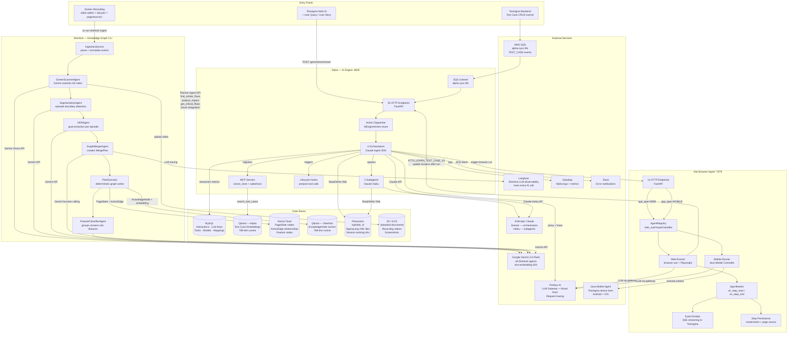

# Testsigma AI System — Complete Architecture Flowcharts

> **Five diagrams:** Master overview → Alpha detailed → Sherlock detailed → Atto detailed → Data schemas.  
> Renders natively on GitHub. In VS Code, install the **Mermaid Preview** extension.

---

## Diagram 1 — Master System Overview

*Where every workflow begins, how the three systems connect, and where data lives.*

---

## Diagram 2 — Alpha (AI Engine) Detailed Flow

*Every endpoint, every orchestrator, every hook, every external call.*

```mermaid
flowchart TB
    subgraph ROUTES["HTTP API — All 35 Endpoints"]
        subgraph GEN["Generation Router"]
            G1["POST /generation/generate\nnon-streaming response"]
            G2["POST /generation/stream\nServer-Sent Events SSE"]
        end
        subgraph ATTOR["Atto Router  /atto"]
            A1["GET /atto/test-case/repo_id/case_id\nfetch XML as manual steps"]
            A2["POST /atto/store-test-case-manual-edits\nsave user edits"]
            A3["POST /atto/accept-test-case\nadd to vector ignore list"]
        end
        subgraph SYNCR["Sync Routers  /ts_sync  /ts_sync_public"]
            S1["POST /ts_sync/sync_test_repository/id"]
            S2["POST /ts_sync/sync_test_case/id"]
            S3["DELETE /ts_sync/delete_test_repository/id"]
            S4["POST /ts_sync/copy_test_repository/src/tgt"]
        end
        subgraph TASKR["Tasks + Analytics  /tasks  /jarvis"]
            T1["GET /tasks\ntype + entity_id filter"]
            T2["GET /tasks/task_uuid"]
            T3["GET /jarvis/dashboard/stats\nfrom_ts to_ts"]
            T4["GET /jarvis/dashboard/token_usage"]
            T5["GET /jarvis/logs\npage + size + timezone"]
        end
        subgraph BYOKR["BYOK — Bring Your Own Key  /byok"]
            B1["POST /byok/llm_key\ncreate key"]
            B2["GET /byok/get_all_llm_keys"]
            B3["GET /byok/llm_key/key_id"]
            B4["PUT /byok/llm_key\nupdate key"]
            B5["DELETE /byok/llm_key/key_id"]
            B6["POST /byok/validate_llm_key"]
            B7["POST /byok/map_feature_key\nfeature to key mapping"]
            B8["GET /byok/get_user_llm_config"]
        end
        subgraph OTHR["Other Routers"]
            O1["GET /health\nHealthResponse"]
            O2["GET /models/\ntenant available models"]
            O3["GET /filesystem/tree\nfilesystem browser"]
            O4["GET /filesystem/file-content"]
            O5["api_route /gateway/bedrock/path\nAWS Bedrock proxy"]
            O6["api_route /gateway/path\nPortkey proxy GET POST PUT DELETE PATCH"]
            O7["PATCH /interaction/uuid/feedback\nsave score + feedback"]
            O8["GET /interaction/uuid"]
        end
    end

    subgraph DISPATCH["Action Dispatcher\nAIEngineAction → Service"]
        D1["ATTO_CHAT_TRIGGER_V2\n→ atto_test_case_service_v2"]
        D2["ATTO_EDIT_TEST_CASE_V2\n→ atto_test_case_edit_service"]
        D3["ATTO_LEARN_TEST_CASE_V2\n→ test_case_learn_service"]
        D4["ATTO_COMBINE_TEST_CASES_V2\n→ atto_test_case_combine_service"]
        D5["ATTO_ANALYZER\n→ atto_analyzer_service"]
        D6["ATTO_BUG_DESCRIPTION\n→ atto_bug_description_service"]
        D7["Other actions: recorder, swagger\nauto_heal, figma, visual_analysis"]
    end

    subgraph ORCH["Orchestrators — Claude Agent SDK"]
        OC1["AttoChatOrchestrator\nGENERATION workflow\nModel: Claude Sonnet\nForks session from repr_dir\nSpawns subagents\nRegisters MCP + hooks"]
        OC2["AttoEditOrchestrator\nEDIT single test case\nModel: Claude Sonnet\nOwn session, no subagents\nXML validation hook\nReads + Writes directly"]
        OC3["AttoLearnOrchestrator\nLEARN from browser execution\nModel: Claude Sonnet\nUpdates locators in XML\nFresh session each run"]
        OC4["AttoCombineOrchestrator\nCOMBINE multiple test cases\nModel: Claude Sonnet\nOwn session\nMerges SigmaLang XML files"]
    end

    subgraph SUBAGENTS["Subagents  stored in .claude/agents/"]
        SA1["sigmalang-batch-generator\nModel: Claude Haiku\nGenerates 3 to 5 related test cases\nTools: Read Write Edit\nmcp vector_store\nmcp salesforce if Salesforce app\nContext: test-cases-plan.json"]
        SA2["sigmalang-individual-generator\nModel: Claude Haiku\nGenerates 1 complex test case\nSame tools as batch generator"]
    end

    subgraph MCP["MCP Servers"]
        MCP1["vector-store MCP\nsearch_test_cases\nquery + limit\nreturns ID score description\nread_test_case_by_id\nreturns full XML"]
        MCP2["salesforce MCP\nfetch_salesforce_object_metadata\nfetch_salesforce_object_fields\nSalesforce apps only"]
    end

    subgraph HOOKS["Lifecycle Hooks — fire around every tool call"]
        HK1["pre_write_tool_hook\nvalidate file path is in working dir\nlog test case name"]
        HK2["post_write_tool_hook\nvalidate XML structure after write\ntrigger scenario generation\nupdate session manifest"]
        HK3["post_read_tool_hook\nlog test case name on XML read"]
        HK4["pre_delete_tool_hook\nvalidate path before delete"]
        HK5["post_delete_tool_hook\ncleanup test case file"]
    end

    subgraph SESSION["Session Management"]
        SE1["SessionManager.setup_session_directory\ntest_repo_id + session_id + app_type\nCopy repr_dir to session_dir CoW\nCreate .claude/settings.json\nCreate .claude/agents/ subagent YAMLs\nPLATFORM_SUFFIX_MAP: web mobileweb android ios"]
    end

    subgraph SQS_L["SQS Listener — alpha-sync.fifo"]
        SQ1["receive_message\nextract entityType from body\nRoute: TEST_CASE\neventType DELETE → delete_test_case\neventType CREATE or UPDATE → sync_test_case\nOn error → NotificationService Slack"]
    end

    subgraph STORES["Data Stores"]
        ST1[("MySQL\nAIModel · VirtualKey · LLMKey\nFeatureKeyMapping · Interaction\nLLMRequest · TrackedEntity · AtomTasks")]
        ST2[("Qdrant — Alpha\nCollection: test-cases-production\nIndexed by: tenant_id test_case_id test_repo_id\nPayload: description + XML path")]
        ST3[("Filesystem\n/opt/atto_fs/tenant/id/test-repo-id/\nrepr/ — canonical test case XML\nsession/id/ — working copy\n.claude/ — SDK config + subagents")]
    end

    subgraph EXT_A["External Services"]
        EA1["Anthropic Claude API\nSonnet → orchestrators\nHaiku → subagents\nvia Claude Agent SDK"]
        EA2["Portkey AI\nLLM gateway proxy\nvirtual key routing\nrequest tracing + spans"]
        EA3["Slack\nerror notifications\nNotificationService"]
        EA4["Datadog\nstructured JSON logs\ntelemetry metrics"]
        EA5["AWS SQS\nalpha-sync.fifo\nFIFO ordering\nper-tenant headers"]
    end

    G1 & G2 --> DISPATCH
    A1 & A2 & A3 --> DISPATCH
    D1 --> OC1
    D2 --> OC2
    D3 --> OC3
    D4 --> OC4

    S1 & S2 & S3 & S4 --> SQ1

    OC1 --> SE1
    SE1 -->|"creates working dir"| ST3
    OC1 -->|"spawns"| SA1 & SA2
    OC1 -->|"registers"| MCP1 & MCP2
    OC1 -->|"registers"| HK1 & HK2 & HK3 & HK4 & HK5

    SA1 & SA2 -->|"Read Write Edit XML"| ST3
    MCP1 -->|"vector search"| ST2
    HK2 -->|"XML validated"| ST3

    OC1 & OC2 & OC3 & OC4 -->|"Claude API calls"| EA1
    OC1 -->|"proxy + trace"| EA2
    OC1 -->|"interactions"| ST1
    SQ1 -->|"error"| EA3
    OC1 -->|"logs"| EA4
    EA5 --> SQ1
```

---

## Diagram 3 — Sherlock (Knowledge Graph) Detailed Flow

*From raw screen recording to a fully queryable knowledge graph.*

```mermaid
flowchart TB
    subgraph INPUT["Recording Input"]
        IN1["recording/\nSession video file .webm\nbrowser events tab-events.json\nHTML snapshots pagesources/\nScreenshots screenshots/"]
    end

    subgraph STEP1["Step 1 — Load Recording\nIngestionService"]
        P1A["parse_recording\nread tab-events.json\nextract RawUIEvent list"]
        P1B["clean_selector\nstrip pseudo-classes :hover\nnormalise CSS selectors"]
        P1C["deduplicate_events\n100ms dedup window\nremove rapid duplicates"]
        P1D["normalize\ncompute structural_signature\nSHA256 of cleaned DOM\nextract route_pattern from URL\nassign element_identity"]
        P1E["Output: list of NormalizedUIEvent\ntimestamp_ms · type · clean_selector\ndata · structural_signature\nroute_pattern · element_identity"]
    end

    subgraph STEP2["Step 2 — Screen Scanning\nScreenScannerAgent  Gemini 2.5 Flash"]
        P2A["Upload video to GCS\ngcs_bucket alpha-staging\nprefix sherlock/"]
        P2B["Single batch Gemini call\nsends full video + event list\none LLM call for all screens"]
        P2C["Output: ScreenScanResult\nscreens: list of ScreenIdentity\n  index · screen_name · screen_purpose\n  key_elements · route_pattern · is_modal\nevent_to_screen: dict int to int\nelement_annotations:\n  event_index · element_name · element_description"]
    end

    subgraph STEP2B["Step 2b — Element Annotation\nEnrichment"]
        P2D["For each ElementAnnotation\nfind NormalizedUIEvent by event_index\nmerge annotation into ElementIdentity\nelement_name · element_description · element_context\nif no existing identity: create new one"]
    end

    subgraph STEP3["Step 3 — Segmentation\nSegmentationAgent  Gemini 2.5 Flash"]
        P3A["Gemini call with video + screen context\nidentify where one task ends\nand another begins"]
        P3B["Idle heuristic fallback\nforce segment break\nafter 30s gap between events"]
        P3C["Output: list of SegmentBoundary\nstart_time_ms · end_time_ms\nstart_event · end_event · reason"]
    end

    subgraph STEP4["Step 4 — Goal Extraction\nHERAgent  Gemini 2.5 Flash"]
        P4A["For each SegmentBoundary\nGemini call with video + segment events + screen context"]
        P4B["JSON validation + error feedback loop\nmax 2 retries per episode\nfeedback sent back to LLM if invalid JSON"]
        P4C["Output: GoalExtractionResult\nepisodes: list of EnrichedEpisode\n  episode_index · start_event · end_event\n  start_time_ms · end_time_ms\n  goal · goal_summary · steps\n  variable_slots · variable_values"]
    end

    subgraph STEP5["Step 5 — Graph Merger\nGraphMergerAgent  Gemini 2.5 Flash  function calling"]
        P5A["Full context sent to Gemini:\nvideo + all events + ScreenScanResult\nall SegmentBoundaries + all EnrichedEpisodes"]
        subgraph TOOLS["Read-Only Graph Tools"]
            T1["find_similar_flows\ngoal_text + top_k\nQdrant semantic search\nreturns FlowMatch list\nflow_id · score · goal · anchor_count"]
            T2["get_flow_anchors\nflow_id\nNeo4j lookup\nreturns FlowDetails\nanchors + edges"]
            T3["find_states\nroute_pattern or screen_name_contains\nNeo4j query\nreturns StateSummary list"]
            T4["get_state_details\nstate_id\nNeo4j lookup\nreturns full PageState"]
            T5["find_features\nname_contains · is_critical\nreturns FeatureSummary list"]
            T6["analyze_impact\nquery text\nfull impact analysis\nreturns ImpactAnalysisResult"]
        end
        P5B["Agentic loop max 10 iterations\nLLM calls tools iteratively\nbuilds understanding of existing graph"]
        P5C["MergePlan validation\n_validate_plan_structure\ncheck edge indices are episode-local\nmax 2 validation retries with feedback"]
        P5D["Output: MergePlan\nrecording_id · total_episodes · total_events\ntotal_new_states · total_reused_states\nepisodes: list of EpisodePlan\n  episode_id · event_range · goal\n  match_decision: new_flow or zipper_merge\n  state_plans: action create_new or reuse_existing\n  edge_plans: source_idx target_idx selector\n  knowledge_node_plan: goal steps anchors"]
    end

    subgraph STEP6["Step 6 — Plan Executor\nDeterministic — no LLM"]
        P6A["Phase 1: Create or Reuse PageStates\nstate_dedup_map: screen_name+route → state_id\ntopology.add_page_state → writes to Neo4j\nor topology.increment_state_occurrence"]
        P6B["Phase 2: Create or Update ActionEdges\ntopology.add_action_edge → writes to Neo4j\nmerge observed_values for parametric edges\nis_parametric true for fill events"]
        P6C["Phase 3: Create KnowledgeNodes\nEmbeddings: embed_text goal_text → 768-dim\nQdrant upsert with cosine distance\nlinks anchor_state_ids + path_edge_ids"]
        P6D["Phase 4: Cross-episode edges + entry points\nmark is_entry_point on first state\ncreate edges between last state of ep N\nand first state of ep N+1"]
        P6E["Output: ExecutionResult\nstates_created · states_reused\nedges_created · edges_updated\nknowledge_nodes_created · knowledge_nodes_updated"]
    end

    subgraph STEP7["Step 7 — Feature Classifier\nFeatureClassifierAgent  Gemini 2.5 Flash"]
        P7A["Get all unclassified states\nfrom topology.get_all_states\nwhere feature_id is None"]
        P7B["Gemini call: classify each state\nassign to existing feature\nor suggest new feature name"]
        P7C["Create new Feature nodes\ntopology.add_feature → Neo4j"]
        P7D["Assign states to features\ntopology.assign_state_to_feature → Neo4j\nupdate KnowledgeNode.feature_id in Qdrant"]
    end

    subgraph STORES_SH["Data Stores"]
        SH_NEO[("Neo4j Cloud\nnodes: PageState Feature\nrelationships: ActionEdge\nindexed: id signature screen_name route feature_id")]
        SH_QD[("Qdrant — Sherlock\nCollection: sherlock\nKnowledgeNode vectors 768-dim\nPayload: goal steps anchors feature_id is_critical")]
        SH_GCS[("GCS Bucket: alpha-staging\nPrefix: sherlock/\nvideo files for Gemini")]
        SH_JSON[("Local JSON files\ntopology_graph.json\nimpact_index.json\nselectors → flow IDs reverse index")]
    end

    subgraph EXT_SH["External Services"]
        SH_GEM["Google Gemini 2.5 Flash\nall 5 AI agents\nbatch video analysis"]
        SH_EMB["Vertex AI text-embedding-004\n768-dimensional vectors\ngoal text embeddings"]
        SH_LF["Langfuse\ntrace every LLM call\ncost + latency + quality"]
    end

    subgraph CLI["CLI Commands  uv run sherlock"]
        CLI1["ingest recording_dir session_id\nrun full 7-step pipeline"]
        CLI2["search query\nRAG semantic search\nover KnowledgeNodes"]
        CLI3["impact selector\nwhat flows use this CSS selector"]
        CLI4["stats\ncount KnowledgeNodes in Qdrant"]
        CLI5["graph-stats\ncount PageStates + ActionEdges in Neo4j"]
    end

    INPUT --> P1A --> P1B --> P1C --> P1D --> P1E
    P1E --> P2A & P2B --> P2C
    P2C --> P2D
    P2D --> P3A --> P3B --> P3C
    P3C --> P4A --> P4B --> P4C
    P4C --> P5A
    P5A --> T1 & T2 & T3 & T4
    P5A --> P5B --> P5C --> P5D
    P5D --> P6A --> P6B --> P6C --> P6D --> P6E
    P6E --> P7A --> P7B --> P7C --> P7D

    P2A --> SH_GCS
    P2B & P3A & P4A & P5B & P7B --> SH_GEM
    P6C --> SH_EMB
    P6A & P6B & P7C & P7D --> SH_NEO
    P6C --> SH_QD
    P5B --> SH_LF

    CLI1 --> INPUT
```

---

## Diagram 4 — Atto Browser Agent Detailed Flow

*From HTTP trigger to browser execution, step persistence, and learn-back to Alpha.*

```mermaid
flowchart TB
    subgraph API_AT["HTTP API — All 11 Endpoints  :7979"]
        AT_H["GET /health\nstatus healthy"]
        AT_V["GET /version\napp version string"]
        AT_R["POST /run-agent\nAgentRequest body\ntask_list + attoSessionId + testCaseId\ntoken + app_url + app_type\nmobile_session_id + agent_url + tenant_id\nReturns: task_uuid"]
        AT_TL["GET /task-list/task_uuid\nreturns task-list.json current state"]
        AT_P["POST /pause-agent/task_uuid\nreturns recording_session_id"]
        AT_RS["POST /resume-agent/task_uuid\nResumeRequest body\nhuman_answer + inserted_steps"]
        AT_ST["POST /stop-agent/task_uuid\nstops one agent"]
        AT_SA["POST /stop-all-agents\nstops all in registry\nreturns stopped_count"]
        AT_UA["GET /user-actions/task_uuid/recording-session/id\nreturns user-actions.json"]
        AT_CE["POST /captured-event\nCapturedEvent body\ncontext screenshot or mobile_recorded_action\nvalue + task_uuid + recording_session_id"]
        AT_E["POST /edit-task-list\nEditTaskListRequest\nsteps + instruction + app_url + token\nLLM call to edit steps\nReturns: EditedStepsList"]
    end

    subgraph REGISTRY["AgentRegistry\ntask_uuid to AgentHandle map"]
        REG["Thread-safe registry\nregister + unregister + get\nstop_all → returns count\nfind_paused → returns handle"]
    end

    subgraph HANDLE["AgentHandle Lifecycle"]
        HS["Status: RUNNING"]
        HP["Status: PAUSED\nwait_while_paused blocks"]
        HWH["Status: WAITING_FOR_HUMAN\nask_human called\nrecording_session_id set"]
        HSTOP["Status: STOPPED\nstop called\nunregistered from registry"]
        HCOMP["Status: COMPLETED\nall tasks done\nfinalize_agent_run_common"]
        HS -->|"POST /pause-agent"| HP
        HP -->|"POST /resume-agent"| HS
        HS -->|"ask_human tool"| HWH
        HWH -->|"POST /resume-agent\nhuman_answer set"| HS
        HS -->|"POST /stop-agent"| HSTOP
        HS -->|"all tasks done"| HCOMP
    end

    subgraph AUTH["Auth Flow"]
        AU1["fetch_alpha_auth\nGET app_url/alpha/auth\nBearer token header\nReturns: AlphaAuthResponse\ntoken · is_byok_mode · recorder_preferences"]
    end

    subgraph WEB["Web Agent Runner\nbrowser-use + Playwright Chromium"]
        WR1["Build LLM via build_llm\nmodel: gemini-2.5-pro default\nbase_url: alpha_url/gateway\nheaders: x-trace-id x-proxy-key x-alpha-token x-byok-mode alpha-action"]
        WR2["browser_use.Agent created\ntask = task context\nllm = LangChain LLM\ncontroller = registered actions\nhooks = AgentHooks instance"]
        WR3["register_task_list_controller_actions\ntask_done: marks task COMPLETED → next task\nmodify_task_list: add edit remove skip steps"]
        WR4["browser_use agentic loop\nAgent.run max_steps=200\neach step fires AgentHooks"]
    end

    subgraph WEBHOOKS["AgentHooks — Web Step Lifecycle"]
        WH1["on_step_start\ncheck consecutive_failures >= 3\nif threshold inject escalation ActionResult\nensure JS injected via locator_service\nverify page responsive"]
        WH2["on_step_end\ncount action failures\nextract screenshot page_source goal evaluation memory\nback-fill previous step evaluation\nbuild ActionRecords with locator enrichment\npersist to task-list.json\nemit StepCompletedEvent"]
    end

    subgraph LOCATORS["Locator Enrichment"]
        LO1["LocatorService.find_locators\nelement XPath from browser-use\nGenerate primary_xpath\nGenerate backup_locators: xpath + csspath\nBuild locator_tree\nStored in ActionRecord.backup_locators"]
    end

    subgraph MOBILE["Mobile Runner\nExplicit for-loop — no browser-use"]
        MR1["Build LLM via build_llm\nalpha_action: atto-mobile-learning"]
        MR2["Load mobile system prompt\nload_mobile_system_prompt"]
        MR3["Build MobileControllerRuntime\njava_base: agent_url\nsession_id: mobile_session_id\nplatform: Android or iOS"]
        MR4["22 Mobile Actions\ntap_element_by_index\ninput_text · clear_input\nswipe · swipe_with_coordinates\ngo_back · press_home\nchange_orientation · hide_keyboard\nassert_element_exists · assert_element_not_exists\nassert_element_exists_by_text\nassert_text_equals · assert_text_contains\nassert_element_state\nget_element_text\ntap_at_coordinates\nswitch_to_context · switch_to_window_handle\nwait · ask_human_action · done"]
        MR5["execute_mobile_command\nPOST agent_url/agent/api/v1/mobile_ai/execute\nbody: sessionId platform action arguments\nReturns: toolResult screenshot involvedElement\nprompElementTree pageSource"]
        MR6["For each step:\npause gate → escalation check → build observation\nLLM invoke → re-check pause\nexecute actions → persist → emit events\nif is_done → TaskCompletedEvent → break"]
    end

    subgraph TASKLIST["Task List Data Model"]
        TL1["TaskList\ntasks: list of TaskItem\ncurrent_task_id\nstatus: RUNNING PAUSED COMPLETED STOPPED ERROR\nagent_question: str if waiting for human"]
        TL2["TaskItem\nid · index 1-based · description\nstatus: PENDING IN_PROGRESS COMPLETED SKIPPED REMOVED\nevaluation · actions list\nadded_by: user agent recorded\nreexecute · step_block · last_page_source"]
        TL3["ActionRecord\nuuid · step_uuid · action_name · title\nparams · status: SUCCESS FAIL RUNNING\nresult · evaluation · element\nduration_ms · tsStep\nbackup_locators · locator_tree\nscreenshot file path\npage_source inline HTML capped"]
        TL1 -->|"contains"| TL2
        TL2 -->|"contains"| TL3
    end

    subgraph PERSIST["Step Persistence"]
        PS1["output_dir/browser-agent-data/step_uuid/\nscreenshot.png\npage-source.html\nelement-screenshot-action_uuid.png\nbackup-locators.json\nlocator-tree.json"]
        PS2["task-list.json\nupdated after every step\ncurrent task state + all actions"]
    end

    subgraph EVENTS["Event Emitter — SSE to Testsigma"]
        EV1["SessionCreatedEvent\nsession_metadata dict"]
        EV2["TaskCreatedEvent\ntask · model · session_id"]
        EV3["StepCompletedEvent\nstep_number · evaluation · memory\nnext_goal · actions · screenshot_b64 · page_url"]
        EV4["TaskListUpdatedEvent\ncurrent_task_id · task_count\nchange: task_done add edit remove skip"]
        EV5["TaskCompletedEvent\nsuccess · done_text · agent_state · gif_path"]
        EV6["OutputFileCreatedEvent\nfile_type · file_path"]
        EV_SYNC["CloudSyncHandler\nPOST app_url/api/v1/events\nBearer token\n3 retries exponential backoff"]
        EV1 & EV2 & EV3 & EV4 & EV5 & EV6 --> EV_SYNC
    end

    subgraph LEARN["Learn-Back to Alpha"]
        LB1["After browser run completes\ncall POST alpha_url/generation/generate\naction: ATTO_LEARN_TEST_CASE_V2\npayload: test case ID + locators from run\nAlpha AttoLearnOrchestrator updates XML\nwith real working locators from run"]
    end

    subgraph EXT_AT["External Services"]
        EA1["Portkey AI Gateway\nroutes to: gemini-2.5-pro default\nor tenant BYOK model\nvia Alpha /gateway proxy"]
        EA2["Java Mobile Agent\nagent_url/agent/api/v1/mobile_ai/execute\nTestsigma device farm"]
        EA3["Playwright Chromium\nbrowser automation\nscreenshots + DOM extraction"]
        EA4["Testsigma Backend\napp_url/api/v1/events\nCloudSyncHandler event delivery"]
    end

    AT_R -->|"validate token"| AU1
    AU1 -->|"AlphaAuthResponse"| REG
    REG -->|"app_type=WEB"| WR1
    REG -->|"app_type=MOBILE"| MR1

    WR1 --> WR2 --> WR3 --> WR4
    WR4 -->|"each step"| WH1 --> WH2
    WH2 -->|"locator enrichment"| LO1
    WH2 -->|"write files"| PS1 & PS2
    WH2 -->|"emit"| EV3 & EV4

    MR1 --> MR2 --> MR3 --> MR4 --> MR5 --> MR6
    MR6 -->|"write files"| PS1 & PS2
    MR6 -->|"emit"| EV3 & EV4 & EV5

    AT_P --> HP
    AT_RS --> HS
    AT_CE -->|"screenshot context"| PS1
    AT_CE -->|"mobile_recorded_action"| MR6

    WH2 -->|"update"| TL1
    MR6 -->|"update"| TL1

    WR4 -->|"LLM calls"| EA1
    MR1 -->|"LLM calls"| EA1
    WR4 -->|"browser control"| EA3
    MR5 -->|"execute actions"| EA2
    EV_SYNC --> EA4

    HCOMP -->|"trigger learn-back"| LB1
    LB1 -->|"POST /generation/generate"| EA1
```

---

## Diagram 5 — Data Schemas

*Key data models and how they relate across all three systems.*

```mermaid
flowchart TB
    subgraph SIGMALANG["SigmaLang XML — Test Case Format\nstored in /opt/atto_fs on Filesystem"]
        SL1["TestCase\nID: int\nname: str\nplatform: web android ios"]
        SL2["TestStep\ndescription: str\naction element: csspath or xpath selector\ntestData: str value to use"]
        SL3["Action Types\nNavigateTo testData=URL\nClick element=selector\nEnterText element=selector testData=text\nVerifyText element=selector testData=expected\nWaitForElement element=selector\nSelectOption element=selector testData=value"]
        SL1 -->|"contains 1 to N"| SL2
        SL2 -->|"uses one of"| SL3
    end

    subgraph SHERLOCK_SCHEMAS["Sherlock Knowledge Graph Schemas"]
        PS["PageState — unique application screen\nid: state_uuid\nscreen_name: User Profile Edit Page\nscreen_purpose: allows editing profile info\nkey_elements: list of str email field save button\nstructural_signature: SHA256 of cleaned DOM\nroute_pattern: /users/id/edit\nscreenshot_ref: screenshots/state_123.png\noccurrence_count: int seen N times\nis_entry_point: bool\nis_error_state: bool\nfeature_id: feat_uuid or None\nfirst_seen_episode_id: ep_uuid\nlast_seen_timestamp: float"]

        AE["ActionEdge — transition between screens\nid: edge_uuid\nsource_id: PageState.id\ntarget_id: PageState.id\naction_type: click fill navigation\nselector: CSS or XPath\nis_parametric: bool fill events vary\nobserved_values: list of str all seen values\nelement_identity: ElementIdentity\ntraversal_count: int\nfirst_seen_timestamp: float\nlast_seen_timestamp: float\nsource_episode_ids: list of str"]

        KN["KnowledgeNode — user workflow goal\nid: node_uuid\ngoal_text: User completes a purchase\nanchor_state_ids: list of PageState.id\npath_edge_ids: list of ActionEdge.id\nsteps: list of str human readable\ndetected_parameters: dict slot to values\nstatus: ACTIVE DEPRECATED REVIEW\noccurrence_count: int\nis_smoke_test: bool\nis_critical_path: bool\nfeature_id: feat_uuid or None\nparent_node_id: str or None\nchild_node_ids: list of str\nsource_episode_ids: list of str"]

        FT["Feature — logical screen grouping\nid: feat_uuid\nname: Checkout\ndescription: screens for purchase flow\nis_critical: bool\nstate_count: int\nflow_count: int\nparent_feature_id: str or None"]

        EL["ElementIdentity — enriched element info\nid: elem_uuid\nelement_name: Submit Order Button\nelement_description: primary CTA for checkout\ntag_name: button\nelement_type: submit\nrole: button\ntext_content: Place Order\naria_label: str\nplaceholder: str\nparent_context: str\nnearby_headings: list of str\nselector_strategies: list of str"]

        FT -->|"groups"| KN
        FT -->|"spans"| PS
        KN -->|"anchors 1 to N"| PS
        AE -->|"source"| PS
        AE -->|"target"| PS
        AE -->|"has"| EL
    end

    subgraph ALPHA_SCHEMAS["Alpha Data Schemas — MySQL"]
        ADB1["Interaction\nid · uuid · user_id\nentity_id FK TrackedEntity\nquery · feedback_score · feedback\naccepted_suggestions · total_suggestions\nduration · status · timestamp"]
        ADB2["LLMRequest\nid · interaction_id FK\nuser_id · trace_id · action · model\nprompt_tokens · prompt_cost\ncompletion_tokens · completion_cost\nstatus · status_reason · timestamp · duration"]
        ADB3["LLMKey\nid · user_id · creator_id\nname · description · provider\nauth_details JSON\ncreated_at · updated_at"]
        ADB4["FeatureKeyMapping\nfeature_name PK · user_id PK\nllm_key_id FK LLMKey\nllm_model_name · created_at · updated_at"]
        ADB5["AtomTasks\nuuid · type · status\nentity_id · percent_complete\ndata JSON · created_at · updated_at"]
        ADB1 -->|"has many"| ADB2
        ADB3 -->|"mapped to features via"| ADB4
    end

    subgraph ATTO_SCHEMAS["Atto Browser Agent Schemas"]
        ATM1["AgentRequest\ntask_list: list of TaskInput\nattoSessionId · testCaseId · token · app_url\napp_type: WEB ANDROID_NATIVE IOS_NATIVE\nmobile_session_id · agent_url · tenant_id\nenvironment_variables: list of EnvironmentVariable"]
        ATM2["TaskList\ntasks: list of TaskItem\ncurrent_task_id · status\nagent_question · task_list_modification"]
        ATM3["TaskItem\nid · index 1-based · description\nstatus: PENDING IN_PROGRESS COMPLETED SKIPPED REMOVED\nevaluation · actions: list of ActionRecord\nadded_by: user agent recorded\nreexecute · step_block · last_page_source"]
        ATM4["ActionRecord\nuuid · step_uuid · action_name · title\nparams dict · status: SUCCESS FAIL RUNNING\nresult · evaluation · element\nduration_ms · tsStep dict\nbackup_locators: list of BackupLocator\nlocator_tree: LocatorTree\nscreenshot: file path\npage_source: inline HTML capped"]
        ATM5["BackupLocator\ntype: xpath or csspath\nvalue: selector string"]
        ATM1 -->|"creates"| ATM2
        ATM2 -->|"contains"| ATM3
        ATM3 -->|"contains"| ATM4
        ATM4 -->|"has"| ATM5
    end

    subgraph STORAGE_SUMMARY["Where Each Schema Lives"]
        SS1["SigmaLang XML → Filesystem /opt/atto_fs\nAlpha reads and writes test cases here\nSubagents generate XML into this dir"]
        SS2["PageState + ActionEdge + Feature → Neo4j Cloud\nKnowledgeNode text + metadata → Qdrant Sherlock\nKnowledgeNode embedding 768-dim → Qdrant Sherlock"]
        SS3["Test Case Embeddings → Qdrant Alpha\nsearched by MCP vector-store tool\nfor context-aware test generation"]
        SS4["Interaction + LLMRequest + LLMKey → MySQL Alpha\nAtomTasks → MySQL Alpha"]
        SS5["TaskList + ActionRecord → task-list.json\nscreenshots + page source → filesystem\nevents → SSE to Testsigma Backend"]
    end
```

---

## Quick Reference — All AI Agents

| System | Agent | Model | Input | Output | Purpose |
|--------|-------|-------|-------|--------|---------|
| **Alpha** | AttoChatOrchestrator | Claude Sonnet | User query + context | Test cases XML | Generate test cases |
| **Alpha** | AttoEditOrchestrator | Claude Sonnet | Test case ID + edits | Updated XML | Edit one test case |
| **Alpha** | AttoLearnOrchestrator | Claude Sonnet | Browser run results | Updated XML locators | Update locators from real run |
| **Alpha** | AttoCombineOrchestrator | Claude Sonnet | Multiple test case IDs | Merged XML | Merge test cases |
| **Alpha** | sigmalang-batch-generator | Claude Haiku | test-cases-plan.json | 3–5 XML files | Batch generate |
| **Alpha** | sigmalang-individual-generator | Claude Haiku | test-cases-plan.json | 1 XML file | Single complex test |
| **Sherlock** | ScreenScannerAgent | Gemini 2.5 Flash | Video + events | ScreenScanResult | Identify unique screens |
| **Sherlock** | SegmentationAgent | Gemini 2.5 Flash | Video + events + screens | SegmentBoundary list | Find episode boundaries |
| **Sherlock** | HERAgent | Gemini 2.5 Flash | Video + segments + screens | GoalExtractionResult | Extract user goals |
| **Sherlock** | GraphMergerAgent | Gemini 2.5 Flash | Full context + graph tools | MergePlan JSON | Plan graph updates |
| **Sherlock** | FeatureClassifierAgent | Gemini 2.5 Flash | PageStates + features | ClassificationResult | Group screens into features |
| **Atto** | Web Agent (browser-use) | Gemini 2.5 Pro | Task list + browser state | Actions + screenshots | Execute web tests |
| **Atto** | Mobile Runner (LLM loop) | Gemini 2.5 Pro | Task list + device state | 22 mobile actions | Execute mobile tests |

## Quick Reference — All Data Stores

| Store | Tech | Used By | What It Holds |
|-------|------|---------|---------------|
| Filesystem `/opt/atto_fs` | OS filesystem | Alpha | SigmaLang XML test cases, session working dirs |
| Qdrant Alpha | Qdrant vector DB | Alpha MCP | Test case embeddings for semantic search |
| MySQL | Relational DB | Alpha | Interactions, LLM keys, tasks, models, metrics |
| Neo4j Cloud | Graph DB | Sherlock | PageState nodes, ActionEdge relations, Feature nodes |
| Qdrant Sherlock | Qdrant vector DB | Sherlock | KnowledgeNode goal embeddings |
| GCS `alpha-staging/sherlock/` | Google Cloud Storage | Sherlock | Video files for Gemini analysis |
| S3 / GCS | Object storage | Alpha | Uploaded documents, PDFs, Figma files |
| Local JSON `data/` | JSON files | Sherlock dev | topology_graph.json, impact_index.json |
