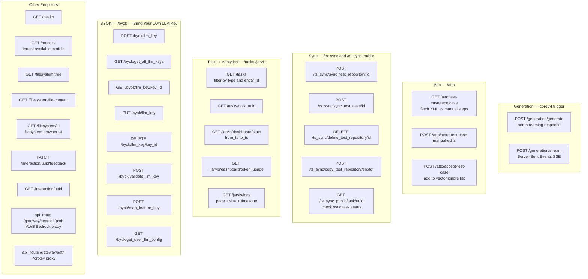
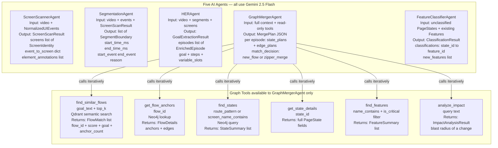
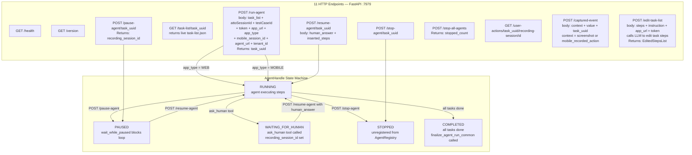
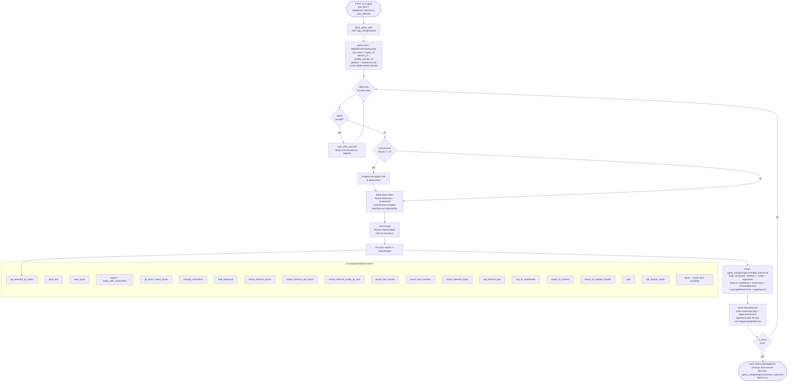
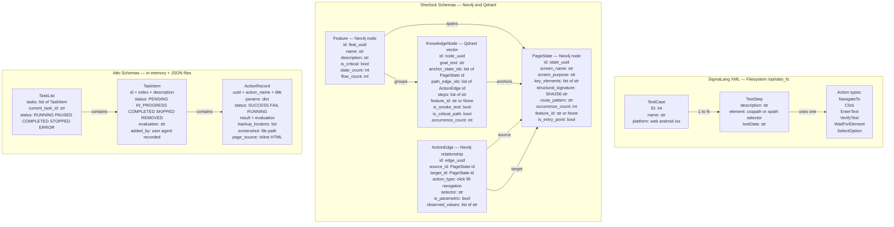

# Testsigma AI System — Architecture Flowcharts

> Eight focused diagrams + quick-reference tables.  
> Every diagram is sized to render correctly on GitHub.

---

## 1 · Master System Overview

How the three systems connect, where workflows begin, and how data flows between them.

---

## 2 · Alpha — Request to Test Case (Core Pipeline)

From a user query all the way to generated SigmaLang XML files on disk.

---

## 3 · Alpha — All HTTP Endpoints

Every route, method, and what it does.

---

## 4 · Sherlock — 7-Step Ingestion Pipeline

From a raw screen recording to a fully populated knowledge graph.

---

## 5 · Sherlock — Agents and Graph Tools

What each AI agent does and which tools the GraphMergerAgent can call.

---

## 6 · Atto — All HTTP Endpoints and Agent Lifecycle

Every route and the AgentHandle state machine.

---

## 7 · Atto — Web Agent Loop

How a web test executes step-by-step using browser-use and Playwright.

```mermaid
flowchart TD
    START([POST /run-agent\napp_type = WEB])

    AUTH[fetch_alpha_auth\nGET app_url/alpha/auth\nReturns: token + is_byok_mode]

    BUILD[build_llm\nmodel: gemini-2.5-pro default\nbase_url: alpha_url/gateway\nheaders: x-trace-id x-proxy-key\nx-alpha-token x-byok-mode alpha-action]

    AGENT[browser_use.Agent created\ntask = task context string\nllm = LangChain LLM\ncontroller = task_done + modify_task_list\nhooks = AgentHooks instance]

    LOOP{Agent loop\nmax 200 steps}

    STEP_START[on_step_start hook\ncheck consecutive_failures\nif failures >= 3: inject escalation\nensure JS injected via locator_service\nverify page responsive]

    LLM_CALL[LLM decides next action\nbrowser screenshot + DOM\nreturns action: click fill navigate scroll assert]

    EXECUTE[Execute action in Playwright\nCapture result]

    STEP_END[on_step_end hook\ncount failures\nextract screenshot + page_source\nextract goal + evaluation + memory\nback-fill previous step evaluation\nenrich ActionRecord with locators\npersist to task-list.json\nemit StepCompletedEvent]

    LOCATOR[LocatorService.find_locators\nprimary XPath\nbackup_locators: xpath + csspath list\nlocator_tree for Testsigma]

    PERSIST[Write to disk\noutput_dir/browser-agent-data/step_uuid/\nscreenshot.png\npage-source.html\nbackup-locators.json\nlocator-tree.json\ntask-list.json]

    DONE{all tasks\ndone?}

    LEARN[LEARN back to Alpha\nPOST alpha_url/generation/generate\naction: ATTO_LEARN_TEST_CASE_V2\nAlpha updates XML with real locators]

    COMPLETED([Session COMPLETED\nfinalize_agent_run_common])

    START --> AUTH --> BUILD --> AGENT --> LOOP
    LOOP --> STEP_START --> LLM_CALL --> EXECUTE --> STEP_END
    STEP_END --> LOCATOR --> PERSIST --> DONE
    DONE -->|no| LOOP
    DONE -->|yes| LEARN --> COMPLETED
```

---

## 8 · Atto — Mobile Agent Loop

How a native Android or iOS test executes without a browser.

---

## 9 · Data Schemas

Key data models across all three systems and where each one lives.

---

## Quick Reference — All AI Agents

| System | Agent | Model | Input | Output |
|--------|-------|-------|-------|--------|
| Alpha | AttoChatOrchestrator | Claude Sonnet | User query + context | SigmaLang XML files |
| Alpha | AttoEditOrchestrator | Claude Sonnet | Test case ID + edit instructions | Updated XML |
| Alpha | AttoLearnOrchestrator | Claude Sonnet | Browser run locator results | Updated XML locators |
| Alpha | AttoCombineOrchestrator | Claude Sonnet | Multiple test case IDs | Single merged XML |
| Alpha | sigmalang-batch-generator | Claude Haiku | test-cases-plan.json | 3–5 XML files |
| Alpha | sigmalang-individual-generator | Claude Haiku | test-cases-plan.json | 1 XML file |
| Sherlock | ScreenScannerAgent | Gemini 2.5 Flash | Video + events | ScreenScanResult |
| Sherlock | SegmentationAgent | Gemini 2.5 Flash | Video + events + screens | SegmentBoundary list |
| Sherlock | HERAgent | Gemini 2.5 Flash | Video + segments + screens | GoalExtractionResult |
| Sherlock | GraphMergerAgent | Gemini 2.5 Flash | Full context + graph tools | MergePlan JSON |
| Sherlock | FeatureClassifierAgent | Gemini 2.5 Flash | PageStates + features | ClassificationResult |
| Atto | Web Agent (browser-use) | Gemini 2.5 Pro | Task list + browser state | Actions + screenshots |
| Atto | Mobile Runner (LLM loop) | Gemini 2.5 Pro | Task list + device state | 22 mobile actions |

## Quick Reference — All Data Stores

| Store | Technology | Used By | What It Holds |
|-------|-----------|---------|---------------|
| `/opt/atto_fs` | OS filesystem | Alpha | SigmaLang XML, session working dirs |
| Qdrant Alpha | Qdrant vector DB | Alpha MCP | Test case embeddings for semantic search |
| MySQL | Relational DB | Alpha | Interactions, LLM keys, tasks, models, metrics |
| Neo4j Cloud | Graph DB | Sherlock | PageState, ActionEdge, Feature nodes |
| Qdrant Sherlock | Qdrant vector DB | Sherlock | KnowledgeNode goal embeddings 768-dim |
| GCS `alpha-staging/sherlock/` | Google Cloud Storage | Sherlock | Video files uploaded for Gemini analysis |
| S3 / GCS | Object storage | Alpha | Uploaded documents, PDFs, Figma files |
| `data/topology_graph.json` | JSON file | Sherlock dev | NetworkX graph persisted locally |
| `data/impact_index.json` | JSON file | Sherlock dev | selector → flow IDs reverse index |
