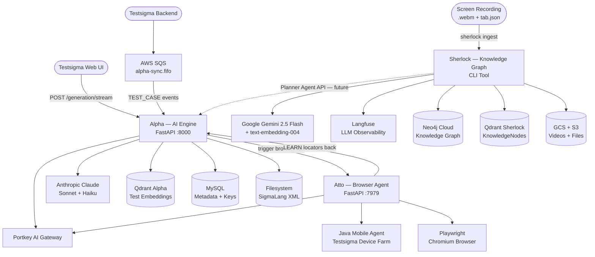
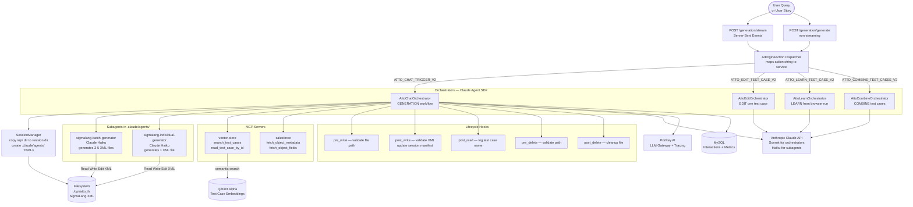
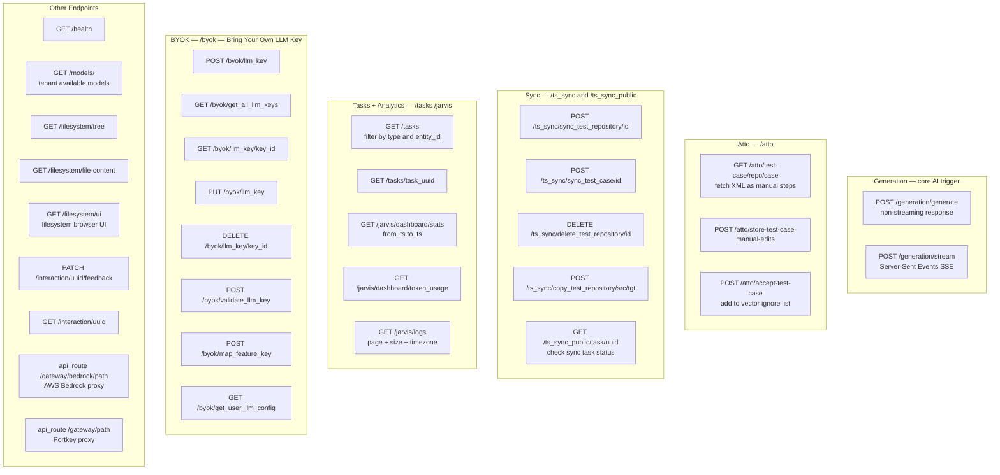
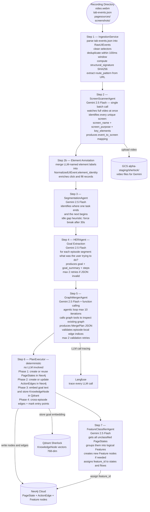
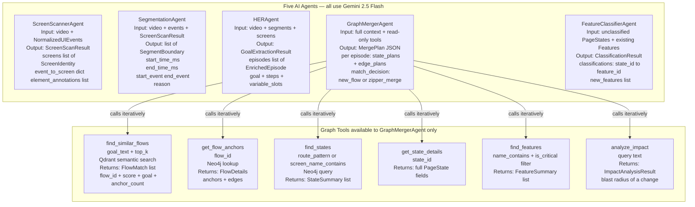
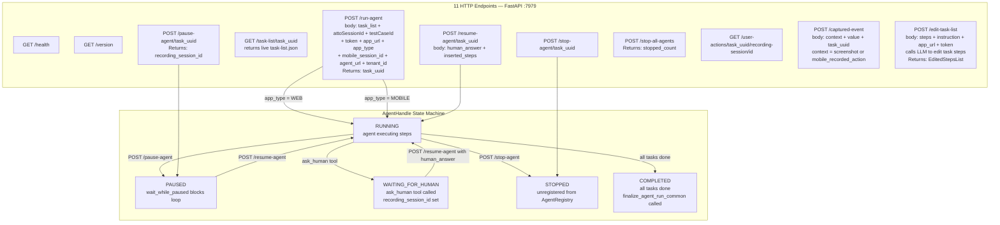
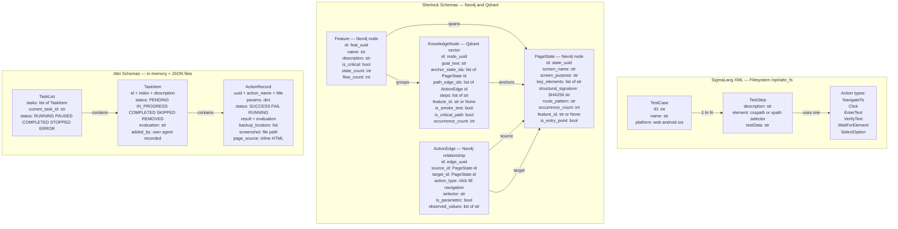

# Testsigma AI System — Architecture Flowcharts

> Eight focused diagrams + quick-reference tables.  
> Every diagram is sized to render correctly on GitHub.

---

## 1 · Master System Overview

How the three systems connect, where workflows begin, and how data flows between them.



### Explanation

#### What this system is, in plain language

Testsigma's AI system is made of three cooperating services that together handle the full lifecycle of automated software testing — from understanding what an application does, to writing tests for it, to running those tests and learning from real execution.

Think of it like a three-person team:

- **Alpha** is the writer. It receives instructions from a user or the backend, thinks about what test steps are needed, and produces test automation scripts.
- **Sherlock** is the researcher. It watches screen recordings of someone using the application and builds a structured knowledge base of what the application does, what screens it has, and what workflows exist.
- **Atto** is the runner. It takes test scripts and actually executes them in a real browser or on a real mobile device, proving whether the script works and collecting hard evidence (screenshots, locators, page sources) along the way.

These three systems are not isolated. They share information continuously, which is what makes the overall system intelligent rather than just mechanical.

---

#### The three entry points

There are three ways new information enters the system:

1. **A user types something in the Testsigma Web UI.** They might describe a test they want generated, or ask for a modification to an existing test. This triggers a `POST /generation/stream` call directly into Alpha.

2. **The Testsigma backend sends a sync event.** When a test case is created or updated in the backend database, it publishes a `TEST_CASE` event onto an AWS SQS queue called `alpha-sync.fifo`. Alpha consumes these events asynchronously so the vector store stays up to date even when no human is actively interacting.

3. **A screen recording arrives.** When a QA engineer or developer uses the application and a recording is captured, that recording directory is fed into Sherlock via its CLI ingestion command. Sherlock takes over from there without any user involvement.

---

#### What Alpha does

Alpha is the AI test generation engine. Its job is to take a high-level intent — "generate login tests" or "edit this test case to check error messages" — and produce SigmaLang XML files that describe the test steps in a format Testsigma can execute.

To do that, Alpha:
- Uses **Anthropic Claude** (Sonnet model for orchestration, Haiku model for bulk XML generation) as its reasoning engine.
- Routes all LLM calls through **Portkey**, which acts as a governed gateway layer handling routing, retries, and request tracing.
- Queries **Qdrant Alpha** to find semantically similar test cases that have been generated before, so it does not start from scratch every time.
- Stores operational metadata — interaction records, task results, LLM keys, usage metrics — in **MySQL**.
- Writes finished test cases as XML files to the **filesystem** at `/opt/atto_fs`.

Alpha can also trigger Atto when it needs execution-level validation. If a generated test needs to be run in a real browser to confirm its locators are valid, Alpha sends that request to Atto and waits for the results.

---

#### What Sherlock does

Sherlock is the learning and knowledge-graph system. It does not generate tests directly. Instead, it transforms raw, noisy observational data into structured, reusable product knowledge.

Its inputs are a recording directory containing:
- A `.webm` video of someone using the application
- A `tab-events.json` file of browser interaction events
- HTML page sources captured during the session
- Screenshots captured at key moments

Its outputs are structured data stored in:
- **Neo4j Cloud**, which holds a graph of pages, navigation transitions, and feature groupings
- **Qdrant Sherlock**, which holds semantic embeddings of user goals so similarity search is possible
- **GCS (Google Cloud Storage)**, which holds the raw video files uploaded for Gemini to analyze

Sherlock uses **Gemini 2.5 Flash** for all its AI reasoning — video understanding, segmentation, goal extraction, and graph merging decisions. All LLM calls are traced in **Langfuse** for observability.

In the future, Sherlock's knowledge graph will be queryable by Alpha through a Planner Agent API, allowing Alpha to write better tests because it knows the actual application structure.

---

#### What Atto does

Atto is the execution agent. It runs test scripts in the real world — either in a Chromium browser using **Playwright** or on a native mobile device via a **Java mobile agent** connected to Testsigma's device farm.

Atto does not just play back scripts. During execution, it:
- Observes the current state of the browser or device
- Asks an LLM what action to take next
- Executes that action
- Captures screenshots, page source, and locator data for every step

After a successful run, Atto sends the real locators it discovered back to Alpha using the `ATTO_LEARN_TEST_CASE_V2` action. This closes the feedback loop: Alpha generates a test based on its understanding, Atto proves it in the real application, and the resulting XML is updated with locators that are known to work.

---

#### The storage layer in detail

Each storage system serves a distinct purpose:

| Storage | Technology | Purpose |
|---|---|---|
| `/opt/atto_fs` | OS filesystem | Raw SigmaLang XML files — the final test artifacts |
| Qdrant Alpha | Vector database | Embeddings of past test cases so Alpha can find similar ones by meaning |
| MySQL | Relational database | Interactions, LLM key configurations, tasks, usage metrics |
| Neo4j Cloud | Graph database | Sherlock's knowledge: screens, transitions, features, flows |
| Qdrant Sherlock | Vector database | Semantic embeddings of user goals, 768-dimensional vectors |
| GCS / S3 | Object storage | Video files for Gemini, uploaded PDFs and Figma files |

No single storage system stores everything. Each is chosen because it matches the data type: relational for structured metadata, vector for semantic similarity, graph for interconnected relationships, object storage for heavy binary files.

---

#### Why the three-system split matters

The reason Alpha, Sherlock, and Atto exist as separate services rather than one monolithic system is separation of concerns:

- **Alpha** needs to be fast and interactive. Users expect near-real-time responses when generating tests.
- **Sherlock** processes recordings in batch. It can run slower and more thoroughly without blocking any user interaction.
- **Atto** needs to control a real browser or device. Isolation from the generation layer prevents execution crashes from affecting the API serving user requests.

Each service scales, fails, and deploys independently. They communicate through well-defined APIs and event queues rather than shared memory.

---

## 2 · Alpha — Request to Test Case (Core Pipeline)

From a user query all the way to generated SigmaLang XML files on disk.



### Explanation

#### What this pipeline is, in plain language

This diagram shows the journey of a single request from the moment a user describes what they want to test, all the way to finished XML test case files sitting on disk.

Alpha is not a simple prompt-response system. It is a multi-layered orchestration engine. A single user request triggers session setup, LLM reasoning, retrieval from a vector store, optional Salesforce metadata lookup, XML file generation by specialized subagents, and file validation hooks — all before the response is considered complete.

---

#### The two entry routes

There are two HTTP entry points into Alpha's generation pipeline:

**`POST /generation/stream`** — The streaming route. As the AI generates content, it pushes partial results to the client using Server-Sent Events (SSE). This is what the web UI uses so that users see progress in real time rather than staring at a blank screen for several seconds.

**`POST /generation/generate`** — The non-streaming route. The caller waits for the full response before receiving anything. This is useful for programmatic callers that want the complete result in one chunk.

Both routes funnel into the same `AIEngineAction Dispatcher`, so everything downstream is shared.

---

#### The dispatcher — how Alpha decides what to do

The request body includes an `action` string that tells Alpha which workflow to run. The dispatcher reads this string and selects one of four orchestrators:

| Action String | Orchestrator Selected | What It Does |
|---|---|---|
| `ATTO_CHAT_TRIGGER_V2` | AttoChatOrchestrator | Generate new test cases from scratch |
| `ATTO_EDIT_TEST_CASE_V2` | AttoEditOrchestrator | Edit one specific existing test case |
| `ATTO_LEARN_TEST_CASE_V2` | AttoLearnOrchestrator | Update a test case with real locators from a browser run |
| `ATTO_COMBINE_TEST_CASES_V2` | AttoCombineOrchestrator | Merge multiple test cases into one unified test |

This dispatcher pattern means the HTTP surface is minimal (just two endpoints) while the internal behavior is rich and varied. Adding a new workflow means adding a new action string and orchestrator, not a new route.

---

#### The orchestrators — the brain of each workflow

Orchestrators are built on the **Claude Agent SDK**. They use Claude Sonnet (the more capable, reasoning-focused model) to plan and coordinate work. They do not write XML themselves — they delegate that to subagents.

**AttoChatOrchestrator** is the most complex. When a user asks to generate tests, this orchestrator:
1. Calls `SessionManager` to set up a private working directory for this session.
2. Copies a "representation directory" (a pre-built context snapshot) into that session directory so the subagents have access to relevant context.
3. Creates `.claude/agents/` YAML files that define the subagent roles available in this session.
4. Decides whether to use batch generation (multiple XML files at once) or individual generation (one XML file at a time).
5. Calls MCP tools to retrieve relevant prior test cases and any Salesforce metadata.
6. Streams progress back to the client as generation proceeds.

**AttoEditOrchestrator** is focused. It receives a test case ID and edit instructions, reads the existing XML, applies the changes, and validates the result.

**AttoLearnOrchestrator** is a feedback integrator. When Atto finishes a browser run, it calls Alpha with locator information it discovered during real execution. This orchestrator takes those real locators and rewrites the relevant XML elements to use them instead of speculative ones.

**AttoCombineOrchestrator** merges multiple separate test case files into one coherent test. This is useful when a user has tested individual components and wants an end-to-end flow combining them.

---

#### The subagents — the actual XML writers

Subagents are separate agent definitions loaded from `.claude/agents/` YAML files. They use **Claude Haiku** — faster and cheaper than Sonnet — because their job is structured and repetitive rather than requiring deep reasoning. The orchestrator has already done the high-level thinking; the subagent just needs to produce XML.

**`sigmalang-batch-generator`** produces 3–5 XML files in one call. It is used when the system expects to generate a suite of tests (for example, positive case, negative case, edge case) for a feature.

**`sigmalang-individual-generator`** produces exactly one XML file. It is used for focused generation, refinement, or when the orchestrator wants precise control over each file.

Both subagents have direct read and write access to the session filesystem. They use standard file tools (`Read`, `Write`, `Edit`) to manipulate XML files in the session directory.

---

#### The MCP servers — external knowledge tools

MCP (Model Context Protocol) servers give the orchestrator access to knowledge that is not in the prompt. Two MCP servers are active during generation:

**`vector-store` MCP server** exposes two tools:
- `search_test_cases` — performs a semantic vector search in Qdrant Alpha. Given a natural language query like "login with invalid credentials," it returns the most similar test cases that have been generated before. This prevents duplication and seeds the new generation with proven patterns.
- `read_test_case_by_id` — fetches a specific test case by its ID so the orchestrator can include its full content as context.

**`salesforce` MCP server** exposes:
- `fetch_object_metadata` — returns metadata about a Salesforce object (e.g., the Lead object, the Opportunity object).
- `fetch_object_fields` — returns the field definitions for a Salesforce object so the generated test case uses real field names and types.

Without these MCP servers, Alpha would have to hallucinate test structures. With them, it can ground its generation in real knowledge.

---

#### The hook layer — keeping files safe

Every file operation inside the generation session passes through lifecycle hooks. These are not optional middleware — they are integral to correctness:

| Hook | Trigger | What it does |
|---|---|---|
| `pre_write` | Before any file is written | Validates that the path is inside the allowed session directory; prevents writes to arbitrary filesystem locations |
| `post_write` | After a file is written | Parses the written XML to confirm it is structurally valid; updates the session manifest to track what has been created |
| `post_read` | After a file is read | Logs the name of the test case that was accessed for audit purposes |
| `pre_delete` | Before any file is deleted | Validates that the path is inside the allowed session directory; prevents accidental deletion of system files |
| `post_delete` | After a file is deleted | Cleans up any manifest entries or references to the deleted file |

The hook layer is what makes it safe to give subagents broad filesystem write access. The hooks act as a firewall around file operations so even if a subagent produces a bad path or malformed XML, the system catches it before it causes damage.

---

#### The complete data flow, step by step

1. A user submits a request to `/generation/stream` with an action string and a description of the tests they want.
2. The dispatcher reads the action string and selects `AttoChatOrchestrator`.
3. The orchestrator calls `SessionManager`, which creates a session directory and writes subagent YAML definitions into it.
4. The orchestrator queries the `vector-store` MCP server to find similar existing test cases.
5. Claude Sonnet (via Portkey) reasons about the structure of the tests to generate.
6. The orchestrator fans work out to `sigmalang-batch-generator` or `sigmalang-individual-generator`.
7. Subagents use Claude Haiku to write XML files into the session filesystem.
8. Each write passes through the hook layer — path validation, XML validation, manifest update.
9. The orchestrator streams progress tokens back to the client.
10. MySQL is updated with interaction metadata and token usage.
11. The final XML files remain on disk at `/opt/atto_fs` for downstream consumption.

---

## 3 · Alpha — All HTTP Endpoints

Every route, method, and what it does.



### Explanation

#### What this diagram shows

This is the full API surface of Alpha. Alpha is not just a test generation endpoint — it also handles test repository synchronization, key management, analytics, filesystem browsing, and LLM gateway proxying. Understanding the groupings helps you understand what Alpha is responsible for at the service level.

---

#### Generation routes — the core AI surface

These two routes are what most clients interact with most of the time:

**`POST /generation/generate`** accepts a request body and returns the full AI-generated result once it is complete. The client blocks until the entire generation is done. Best suited for automated pipelines where the caller does not display progressive output.

**`POST /generation/stream`** uses Server-Sent Events. As Alpha generates tokens, partial results stream to the client continuously. The client renders them progressively. This is the route the Testsigma Web UI uses for a responsive user experience during test generation.

Both routes accept the same request body structure, including the action string that determines which orchestrator runs internally.

---

#### The `/atto` routes — test case access and acceptance

These routes bridge Alpha and Atto by exposing test case content in forms that are useful at execution time:

**`GET /atto/test-case/{repo}/{case}`** fetches a generated SigmaLang XML test case and converts it into a human-readable list of manual test steps. This is useful both for display in the UI and as a structured input for Atto when it starts a browser run.

**`POST /atto/store-test-case-manual-edits`** allows a human to modify test steps manually (for example, fixing a step that the AI generated incorrectly) and persist those edits back into the stored XML. This keeps the test case consistent with what the human actually intended.

**`POST /atto/accept-test-case`** marks a test case as accepted by a user. One side effect is that the test case can be added to a "vector ignore list," meaning future vector searches will not keep returning this test case as a similar example. This prevents the system from converging to the same suggestion repeatedly once a test is finalized.

---

#### The `/ts_sync` routes — repository synchronization

These routes exist because Alpha maintains its own internal representation of test repositories. When the Testsigma backend creates or modifies test cases, Alpha needs to stay in sync so its vector embeddings reflect current reality.

**`POST /ts_sync/sync_test_repository/{id}`** triggers a full sync of all test cases inside a test repository. This re-embeds every test case and ensures Qdrant Alpha is up to date.

**`POST /ts_sync/sync_test_case/{id}`** syncs a single test case. Used when a specific test case changes and a full repository sync would be wasteful.

**`DELETE /ts_sync/delete_test_repository/{id}`** removes a test repository from Alpha's internal records and from the vector store. Called when a repository is permanently deleted in the backend.

**`POST /ts_sync/copy_test_repository/{src}/{tgt}`** copies a repository from a source to a target. Used when a user duplicates a test repository in the UI.

**`GET /ts_sync_public/task/{uuid}`** checks the status of a background sync task. Because syncing a large repository can take time, it is executed asynchronously. Callers poll this endpoint to find out when it is done.

---

#### The `/tasks` and `/jarvis` routes — operational visibility

These endpoints provide monitoring and analytics rather than functionality:

**`GET /tasks`** returns a paginated list of background tasks (sync jobs, generation jobs) filtered by type and entity ID.

**`GET /tasks/{task_uuid}`** returns the detailed status of a specific task.

**`GET /jarvis/dashboard/stats`** returns aggregated generation statistics for a time range — how many tests were generated, how many succeeded, error rates.

**`GET /jarvis/dashboard/token_usage`** returns token consumption data broken down by model, tenant, and time. Useful for cost tracking.

**`GET /jarvis/logs`** returns paginated LLM interaction logs with timezone support, so admins can review what the AI generated, when, and with what inputs.

---

#### The `/byok` routes — Bring Your Own Key

Alpha supports a multi-tenant model where each customer can supply their own LLM API keys instead of using Testsigma's shared keys. The `/byok` prefix (Bring Your Own Key) is the management surface for this:

**`POST /byok/llm_key`** — register a new LLM key for the tenant.

**`GET /byok/get_all_llm_keys`** — list all keys registered for the tenant.

**`GET /byok/llm_key/{key_id}`** — fetch the details of one specific key.

**`PUT /byok/llm_key`** — update an existing key (for example, to rotate to a new key value).

**`DELETE /byok/llm_key/{key_id}`** — remove a key.

**`POST /byok/validate_llm_key`** — test whether a provided key is valid by making a lightweight call to the LLM provider.

**`POST /byok/map_feature_key`** — assign a specific key to a specific feature (for example, use Key A for generation and Key B for embedding). This gives tenants fine-grained control over which LLM credentials power which capability.

**`GET /byok/get_user_llm_config`** — returns the complete active LLM configuration for the current user, showing which models and keys are in use.

---

#### The other endpoints — infrastructure support

**`GET /health`** returns a health check response. Used by load balancers and monitoring systems to determine whether Alpha is alive.

**`GET /models/`** returns the list of LLM models available to the current tenant based on their key configuration and feature entitlements.

**`GET /filesystem/tree`** returns the directory structure of the generated test case filesystem at `/opt/atto_fs`. Useful for debugging and for UI components that browse generated files.

**`GET /filesystem/file-content`** returns the raw content of a specific file from the filesystem. Used when a UI component or API client needs to read a generated XML file directly.

**`GET /filesystem/ui`** serves an interactive browser UI for navigating the filesystem. This is a built-in tool for developers and admins to inspect generated artifacts without using the command line.

**`PATCH /interaction/{uuid}/feedback`** allows a user to submit thumbs-up or thumbs-down feedback on a specific AI interaction. This feedback is stored in MySQL and used for quality tracking.

**`GET /interaction/{uuid}`** fetches the full record of a specific AI interaction, including the input, output, model used, tokens consumed, and any feedback.

**`api_route /gateway/bedrock/{path}`** is a transparent proxy to AWS Bedrock. Clients that want to use Bedrock models can route their calls through Alpha's gateway, which handles authentication and adds tracing headers.

**`api_route /gateway/{path}`** is a transparent proxy to Portkey. This allows Atto and other services to route their LLM calls through Alpha's governed gateway without needing separate Portkey credentials.

---

## 4 · Sherlock — 7-Step Ingestion Pipeline

From a raw screen recording to a fully populated knowledge graph.



### Explanation

#### What Sherlock is trying to accomplish

Sherlock solves a fundamental problem: when you first deploy Testsigma on a new application, no one has written tests yet, and the AI does not know what the application looks like or does. Sherlock's ingestion pipeline turns recordings of real user sessions into structured product knowledge — a persistent knowledge graph that Alpha can later draw on to generate better tests.

Think of it like an analyst who watches hours of screen recordings, takes careful notes about every screen they see, identifies the distinct tasks being performed, and organizes all of that into a structured report. Except Sherlock does this automatically using AI.

---

#### Step 1 — IngestionService: cleaning and normalizing raw events

**What it receives:** A `tab-events.json` file containing raw browser interaction events. These events are noisy — they may contain duplicate entries when a user holds down a key, garbled selectors from dynamically generated class names, and unhelpful raw URLs.

**What it produces:** A clean list of `NormalizedUIEvent` objects, each with:
- The event type (click, fill, navigation, etc.)
- A cleaned CSS or XPath selector
- A `structural_signature` — a SHA256 hash computed from the stable structural properties of the element (not including dynamic IDs or session tokens). This hash allows Sherlock to recognize the same element across different sessions even if its exact selector differs.
- A `route_pattern` — a normalized version of the URL that strips dynamic parameters (e.g., `/leads/123` becomes `/leads/:id`). This is critical for grouping events that happen on the same "type" of page.

**Why this step matters:** All downstream AI steps depend on clean, deduplicated, structurally stable events. If the raw events were fed directly to the AI, it would reason about noise instead of signal. The 100ms deduplication window handles cases like rapid double-clicks or keyboard repeat events.

---

#### Step 2 — ScreenScannerAgent: naming the screens

**What it does:** Sends the full video recording (uploaded to GCS for Gemini to access) to Gemini 2.5 Flash in a single batch call. The agent watches the entire video and identifies every distinct screen that appears.

**What it produces:** A `ScreenScanResult` containing:
- A list of `ScreenIdentity` objects, each with a `screen_name`, `screen_purpose`, and list of `key_elements`
- An `event_to_screen` mapping that links each event to the screen it occurred on
- An `element_annotations` list that gives human-readable names to the UI elements involved in interactions

**Why a single batch call rather than frame-by-frame:** Watching the full video at once allows Gemini to understand transitions, recognize when the user returns to a screen they visited before, and name screens based on their full context rather than just a snapshot. Frame-by-frame analysis would produce fragmented, inconsistent screen names.

**Why this matters:** Without screen naming, Sherlock would only know "a click happened at selector X." With screen naming, it knows "the user clicked the Save button on the Lead Creation screen." This semantic enrichment is the foundation for everything that follows.

---

#### Step 2b — Element Annotation: enriching interactions

This is a brief post-processing step that merges the element names from the `ScreenScannerAgent` output into each `NormalizedUIEvent`. Before this step, an event might say "user filled selector `.input-email`." After this step, it says "user filled the Email field on the Login screen." Every downstream agent sees semantically enriched events rather than raw selectors.

---

#### Step 3 — SegmentationAgent: finding task boundaries

**What it does:** Looks at the enriched events and screen scan result and identifies where one distinct user task ends and a new one begins.

**What it produces:** A list of `SegmentBoundary` objects, each with:
- `start_time_ms` and `end_time_ms`
- The first and last events in the segment
- A reason explaining why the boundary was placed here

**The 30-second idle gap heuristic:** If the user is inactive for 30 seconds or more, Sherlock forces a segment boundary regardless of what the AI says. This is a deterministic safeguard that prevents extremely long segments when the user paused between tasks without a visible UI change.

**Why segmentation matters:** A recording often contains multiple tasks — the user might create a new contact, then export a report, then change a setting. If these were treated as one task, the extracted goal would be meaningless. Segmentation ensures each episode has exactly one coherent goal.

---

#### Step 4 — HERAgent (Goal Extraction): understanding what the user was doing

**What it does:** For each segment identified in Step 3, HERAgent asks Gemini: "Looking at this video segment and the events in it, what was the user trying to accomplish?"

**What it produces:** A `GoalExtractionResult` containing a list of `EnrichedEpisode` objects. Each episode has:
- `goal` — a concise statement of intent (e.g., "Create a new lead with company name and email")
- `goal_summary` — a one-sentence plain English description
- `steps` — an ordered list of what the user did to achieve the goal
- `variable_slots` — fields where the specific value used is a variable (e.g., the email address could be anything; it is the "email" slot that matters)

**Why retries:** Gemini's response is expected in JSON. If the response is invalid JSON or missing required fields, HERAgent retries up to 2 times with a corrective prompt. This is important for reliability in a pipeline that runs without human oversight.

**Why this step is the most important:** Goal extraction is what lifts Sherlock from "we saw clicks happen" to "we know what the user was trying to do." This goal becomes the semantic anchor for everything stored in the knowledge graph. Alpha can later search for "flows similar to creating a new lead" and find this episode because its goal was explicitly labeled.

---

#### Step 5 — GraphMergerAgent: deciding how new episodes fit into existing knowledge

**What it does:** This is the most complex step. The agent receives the full context (all episodes with their goals and steps) and uses an agentic loop to compare each episode against the existing knowledge graph. It queries graph tools to understand what is already known, then produces a `MergePlan` that says exactly what to create, reuse, or modify.

**How the agentic loop works:** GraphMergerAgent can call graph inspection tools iteratively, up to 10 iterations. In each iteration it might:
1. Search for flows similar to the current episode's goal
2. Fetch the anchor states and edges of a matching flow
3. Check whether specific PageStates already exist for the route patterns seen in this episode
4. Query for related features

After gathering enough information, it produces the MergePlan.

**What the MergePlan contains:** For each episode:
- `state_plans` — for each screen visited, whether to create a new `PageState` or reuse an existing one (identified by ID)
- `edge_plans` — for each transition between screens, whether to create a new `ActionEdge` or update an existing one
- `match_decision` — either `new_flow` (this is genuinely new) or `zipper_merge` (this episode traces a path through known states and should be merged into an existing flow)

**Why this matters:** Without a merge step, Sherlock would create a new node for every screen in every recording, even if the same screen had been seen a hundred times before. Over time the graph would become impossibly large and fragmented. GraphMergerAgent is what keeps the knowledge graph stable and growing intelligently.

---

#### Step 6 — PlanExecutor: applying the plan deterministically

**What it does:** Takes the MergePlan from Step 5 and applies it to the databases. No LLM is involved in this step — it is pure deterministic execution.

The executor runs in four phases:

**Phase 1 — PageStates in Neo4j:** For each state plan that says "create," it creates a new `PageState` node with all its properties. For each that says "reuse," it increments the `occurrence_count` of the existing node to reflect that this screen was seen again.

**Phase 2 — ActionEdges in Neo4j:** Creates or updates the transition relationships between page states. If an edge already exists (e.g., clicking Save on the Lead form has been seen before), it updates it with any new information from this episode.

**Phase 3 — KnowledgeNode in Qdrant:** Takes the episode's goal text, embeds it using Gemini's `text-embedding-004` model into a 768-dimensional vector, and stores it as a `KnowledgeNode` in Qdrant Sherlock. This is what enables semantic goal search later.

**Phase 4 — Cross-episode structure:** Creates edges that connect flows across episode boundaries, and marks certain states as entry points (states that are a valid starting position for a flow).

**Why the separation between agent and executor:** Having the LLM plan and a deterministic executor apply the plan is a deliberate design choice. The LLM makes the judgment call about what the graph should look like; the executor ensures those changes are applied consistently, with proper error handling, without the LLM having direct write access to production databases.

---

#### Step 7 — FeatureClassifierAgent: grouping screens into product features

**What it does:** After the graph is updated, FeatureClassifierAgent looks at all `PageState` nodes that do not yet have a `feature_id` assigned. It groups them into logical product features.

**Example:** The states for "New Lead form", "Lead list", and "Lead detail view" would all be classified under a "Leads" feature. The agent may reuse an existing Feature node (if "Leads" already exists) or create a new one.

**Why features matter:** PageState and ActionEdge give Sherlock a detailed low-level map. Features give it a high-level map. This is the level at which humans think about software ("the Leads feature has this bug") and at which Alpha can reason about what to test comprehensively ("generate tests that cover the full Leads feature").

---

## 5 · Sherlock — Agents and Graph Tools

What each AI agent does and which tools the GraphMergerAgent can call.



### Explanation

#### The five agents and their roles in sequence

Each of Sherlock's five agents transforms the data into a progressively more structured and meaningful form. They run sequentially, each building on the output of the previous one.

---

#### ScreenScannerAgent — understanding space

**Input:** The raw video file and the normalized event list.

**Primary question it answers:** What distinct screens exist in this application, and which screen was active during each event?

**Output structure:**
- `screens` — a list of `ScreenIdentity` objects. Each has a `screen_name` (human-readable, e.g., "Lead Creation Form"), a `screen_purpose` (what the screen is used for), and `key_elements` (the most important interactive or informational elements visible).
- `event_to_screen` — a dictionary mapping each event's ID to the screen name it occurred on. This is a crucial lookup used by all later agents.
- `element_annotations` — human-readable labels for the specific UI elements involved in events (e.g., "the blue Submit button in the lower-right corner of the form").

**How it uses Gemini:** It uploads the entire video to GCS, then sends a single prompt to Gemini 2.5 Flash that includes the video reference and the event list. Gemini uses its multimodal capability to watch the video and simultaneously reason about the events.

---

#### SegmentationAgent — understanding time

**Input:** Video, events, and the `ScreenScanResult` from ScreenScannerAgent.

**Primary question it answers:** Where does one task end and the next begin?

**Output structure:**
Each `SegmentBoundary` object has:
- `start_time_ms` and `end_time_ms` — the precise time range of the segment
- `start_event` and `end_event` — the first and last event IDs within the segment
- `reason` — a brief explanation of why the boundary was placed here (e.g., "user returned to dashboard, indicating completion of the previous task")

**Key design decision — the 30-second idle gap:** If SegmentationAgent does not find a natural boundary but there is a 30-second or longer gap in events, a boundary is forced. This prevents one long segment spanning multiple unrelated tasks when the user simply paused.

---

#### HERAgent — understanding intent

**Input:** Video, segments (with boundaries), and screen information.

**Primary question it answers:** For each segment, what was the user intending to accomplish?

**Output structure:**
Each `EnrichedEpisode` has:
- `goal` — a precise, concise statement like "Create a new opportunity associated with Acme Corp"
- `goal_summary` — a one-sentence plain English description for human readers
- `steps` — an ordered list of the actions taken to achieve the goal, described in terms of what was done (not which selectors were clicked)
- `variable_slots` — a list of field names where the specific value used is variable. For example, in a "create contact" episode, the first name, last name, and email are variable slots — the important thing is that those fields were filled, not what specific values were used.

**Why variable slots matter:** When Alpha later generates test cases based on this knowledge, it uses the slots to know which fields need test data rather than hard-coding the specific values from the recording.

**Retry behavior:** HERAgent expects JSON output. If Gemini returns malformed JSON or a response missing required fields, HERAgent retries up to 2 times with a corrective instruction before failing the episode. This is necessary because Gemini's structured output compliance is not perfect under complex prompts.

---

#### GraphMergerAgent — understanding relationships

**Input:** All episodes with their goals and steps, plus access to read-only graph tools.

**Primary question it answers:** Given what the graph already knows, how should these new episodes be integrated?

**Output structure — the MergePlan:**
For each episode, the plan specifies:
- `state_plans` — for each screen visited in the episode, either `{action: "create", data: {...}}` to create a new PageState or `{action: "reuse", state_id: "..."}` to link to an existing one
- `edge_plans` — for each transition between screens, either create a new ActionEdge or update an existing one
- `match_decision` — either `new_flow` (this is a genuinely new flow with no match in the graph) or `zipper_merge` (this episode traces through known states and should be merged into an existing flow, incrementing occurrence counts)

**The agentic loop in detail:** GraphMergerAgent runs in a loop of up to 10 iterations. In each iteration it can call any combination of its six tools. A typical sequence for a complex episode might be:

1. Call `find_similar_flows` with the episode's goal text → discover a semantically similar flow already exists
2. Call `get_flow_anchors` on the matched flow → see what states and edges that flow contains
3. Call `find_states` with the route patterns from the new episode → confirm those states already exist in the graph
4. Call `get_state_details` on specific states → verify the existing state matches well enough to reuse
5. Produce a MergePlan that says "reuse states A, B, C; create new edge between B and C; zipper-merge into existing flow"

---

#### FeatureClassifierAgent — understanding purpose

**Input:** A list of `PageState` nodes that have no `feature_id` yet, plus the list of existing `Feature` nodes.

**Primary question it answers:** Which product feature does each unclassified screen belong to?

**Output structure:**
- `classifications` — a dictionary mapping each `state_id` to a `feature_id`
- `new_features` — a list of new Feature definitions if the agent determines that no existing feature covers some of the unclassified states

**Example:** If the graph has a "Contacts" feature and a "Reports" feature but the new recording included screens from a "Bulk Import" workflow, FeatureClassifierAgent would create a new "Bulk Import" feature and classify the relevant states under it.

---

#### The six graph tools — GraphMergerAgent's eyes

These tools give the agent read-only access to the knowledge graph. They are designed to answer specific questions efficiently rather than exposing raw database query access.

**`find_similar_flows(goal_text, top_k)`**
Performs a semantic search in Qdrant Sherlock. Given a natural language goal, returns the top-K most similar flows already in the graph, with their flow IDs, similarity scores, goal text, and anchor count (how many PageStates anchor the flow). This is the agent's first tool call when evaluating a new episode — it establishes whether the episode is truly new.

**`get_flow_anchors(flow_id)`**
Given a flow ID returned by `find_similar_flows`, retrieves the full structural detail: which PageStates anchor this flow, what ActionEdges connect them. This lets the agent compare the structure of the existing flow against the new episode.

**`find_states(route_pattern, screen_name_contains)`**
Searches Neo4j for PageState nodes matching a route pattern or a partial screen name. Used to check whether specific screens already exist before creating duplicates.

**`get_state_details(state_id)`**
Fetches all fields of a specific PageState by ID, including its structural signature, occurrence count, and all associated metadata. Used for precise comparison before deciding to reuse a state.

**`find_features(name_contains, is_critical)`**
Returns Feature nodes matching a name filter, optionally restricted to critical features only. Used by the agent when deciding whether a new episode belongs to an existing feature.

**`analyze_impact(query_text)`**
Returns an `ImpactAnalysisResult` describing the blast radius of a hypothetical change — which other flows, features, or states would be affected if something changed. This is used to prevent the agent from making aggressive merges that would incorrectly link unrelated parts of the graph.

---

## 6 · Atto — All HTTP Endpoints and Agent Lifecycle

Every route and the AgentHandle state machine.



### Explanation

#### What Atto is and why it needs a state machine

Atto is not a simple request-response service. When you call `POST /run-agent`, you start a long-running process that may take minutes, may pause waiting for human input, may be stopped externally, or may fail and need recovery. The state machine is the formalization of all these possible conditions — it makes Atto's behavior predictable and inspectable at any point during execution.

---

#### The 11 HTTP endpoints in detail

**`GET /health`** — a standard health check. Returns 200 if Atto is alive. Used by load balancers, Kubernetes liveness probes, and monitoring systems.

**`GET /version`** — returns the current Atto service version. Useful for verifying deployments and debugging version mismatches between services.

**`POST /run-agent`** — this is the primary entry point. Starting a test run requires:
- `task_list` — the ordered list of tasks the agent should perform (derived from a SigmaLang XML test case)
- `attoSessionId` — a unique identifier for this Atto session, used to correlate artifacts
- `testCaseId` — the ID of the test case being run, used to link results back to Alpha
- `token` — authentication token for calling back into Alpha
- `app_url` — the URL of the application under test
- `app_type` — `WEB`, `ANDROID_NATIVE`, or `IOS_NATIVE`, which determines whether Playwright or the Java mobile agent is used
- `mobile_session_id` — (mobile only) the ID of the active device session on the Java agent
- `agent_url` — (mobile only) the base URL of the Java mobile agent service
- `tenant_id` — the tenant context for multi-tenant isolation

The response is a `task_uuid` that becomes the handle for all subsequent operations on this run.

**`GET /task-list/{task_uuid}`** — returns the live `task-list.json` for a running or completed agent. This file is updated in real time as each step completes, so polling this endpoint gives a live view of progress. Each entry in the list includes the task description, current status, evaluation text, and links to screenshots.

**`POST /pause-agent/{task_uuid}`** — signals the agent to pause. The agent finishes its current step, then enters the `PAUSED` state where its execution loop blocks without burning CPU. Returns a `recording_session_id` that identifies this pause event (useful for correlating screenshots or human interventions with specific pause points).

**`POST /resume-agent/{task_uuid}`** — resumes a paused or waiting agent. The request body can include:
- `human_answer` — if the agent was waiting for human input (via the `ask_human` tool), this provides that input
- `inserted_steps` — if a human wants to inject additional steps at the current point in execution, they are added here

This endpoint is the mechanism for human-in-the-loop testing, where a human can guide or correct the agent mid-run.

**`POST /stop-agent/{task_uuid}`** — terminates a specific agent run immediately. The agent is moved to `STOPPED` state and removed from the `AgentRegistry`. Resources (browser sessions, device connections) are cleaned up.

**`POST /stop-all-agents`** — terminates every currently running agent. Returns the count of agents that were stopped. Useful for emergency shutdowns or maintenance operations.

**`GET /user-actions/{task_uuid}/recording-session/{id}`** — retrieves the recorded user actions from a specific recording session within a run. This is how the UI displays what the agent did step by step.

**`POST /captured-event`** — allows external sources to push events into a running agent session. The `context` field specifies the type:
- `screenshot` — a screenshot taken externally (e.g., from a mobile device) is associated with the current step
- `mobile_recorded_action` — a native mobile action captured by the device layer is associated with the run

**`POST /edit-task-list`** — allows a human to modify the task list of a running agent using natural language instructions. The endpoint calls an LLM with the current steps and the instruction (e.g., "remove the step that checks the confirmation email and add a step that logs out afterward"), and returns the revised step list. This is how a tester can correct the plan mid-execution without restarting from scratch.

---

#### The state machine in detail

The `AgentHandle` object tracks the current state of each agent run. There are five possible states:

**`RUNNING`** — the agent is actively executing steps. In this state, the execution loop is processing tasks one by one, calling the LLM for each decision, and performing actions in the browser or on the device.

**`PAUSED`** — the agent has been explicitly paused by a `POST /pause-agent` call. The execution loop is suspended using a blocking wait function (`wait_while_paused`). The browser or device session remains open; no actions are being performed. The agent can be resumed at any time.

**`WAITING_FOR_HUMAN`** — the agent's own logic (via the `ask_human` tool available to the LLM) determined that it cannot proceed without human guidance. For example, if the test requires a one-time password that only the human can see, the agent calls `ask_human` and enters this state. The `recording_session_id` is set so the human knows which step triggered the wait. The agent resumes when `POST /resume-agent` is called with a `human_answer`.

**`STOPPED`** — the agent has been externally terminated. The agent is deregistered from the `AgentRegistry` (a service-level map of all running agents), and all associated resources are released. This state is terminal — a stopped agent cannot be resumed.

**`COMPLETED`** — the agent finished all tasks in its task list successfully. Before entering this state, the agent calls `finalize_agent_run_common`, which handles cleanup, final status updates, and optionally the LEARN feedback call back to Alpha. This state is also terminal.

---

#### The valid state transitions

| From | To | Trigger |
|---|---|---|
| RUNNING | PAUSED | `POST /pause-agent` received |
| PAUSED | RUNNING | `POST /resume-agent` received |
| RUNNING | WAITING_FOR_HUMAN | Agent's LLM calls the `ask_human` tool |
| WAITING_FOR_HUMAN | RUNNING | `POST /resume-agent` with `human_answer` received |
| RUNNING | STOPPED | `POST /stop-agent` received |
| RUNNING | COMPLETED | All tasks in the task list reach a final status |

Note that `PAUSED` and `WAITING_FOR_HUMAN` are both "suspended" states, but they have different causes and different resume paths. `PAUSED` is externally triggered (a human decided to pause). `WAITING_FOR_HUMAN` is internally triggered (the agent decided it needs human input).

---

## 7 · Atto — Web Agent Loop

How a web test executes step-by-step using browser-use and Playwright.


### Explanation

#### What this loop is, in plain language

When Atto runs a web test, it does not simply replay a pre-recorded script. Instead, it puts an AI model in front of a real browser and gives it a task list. The model observes the current browser state (a screenshot plus the DOM structure), decides what action to take next, and executes that action through Playwright. This process repeats, step by step, until all tasks are complete.

This approach is fundamentally different from traditional test automation, where a script is literally replayed action by action. Atto's AI-driven approach can handle dynamic pages, timing variations, and minor UI changes that would break a hard-coded script.

---

#### Setup — before the loop begins

**`fetch_alpha_auth`:** Before touching the browser, Atto calls Alpha to retrieve authentication information. Specifically, it calls `GET {app_url}/alpha/auth` and receives:
- An auth token for calling Alpha's APIs during the run
- A `is_byok_mode` flag indicating whether the tenant is using their own LLM keys

This information is needed before `build_llm` can configure the model runtime correctly.

**`build_llm`:** Configures the LangChain LLM wrapper that will be used throughout the run. Key parameters:
- **Model:** `gemini-2.5-pro` by default (the most capable Gemini model for complex reasoning)
- **Base URL:** Alpha's gateway URL, not the model provider directly. This routes all LLM calls through Alpha's governed proxy.
- **Headers:** Several custom headers are injected:
  - `x-trace-id` — a unique ID for distributed tracing across services
  - `x-proxy-key` — the Portkey proxy routing key
  - `x-alpha-token` — the Alpha auth token retrieved in the previous step
  - `x-byok-mode` — signals whether BYOK keys should be used
  - `alpha-action` — tags the LLM call with the action being performed for analytics

**Creating the `browser_use.Agent`:** The agent is instantiated with:
- `task` — a string that provides full task context, including the task list and any relevant application information
- `llm` — the configured LangChain LLM
- `controller` — a set of custom tools the agent can call: `task_done` (signal that a task is complete) and `modify_task_list` (add, remove, or reorder tasks dynamically)
- `hooks` — an `AgentHooks` instance that intercepts step start and step end events

---

#### The loop — step by step

The loop runs for a maximum of 200 steps. This is a safety limit — if a test has not completed after 200 individual browser actions, something is fundamentally wrong and the run should be terminated rather than running forever.

**`on_step_start` hook:** Before the LLM is called, this hook:
1. Checks `consecutive_failures` — if the agent has failed 3 or more steps in a row, it prepends an escalation message to the observation. This tells the model "you have been failing repeatedly; try a different approach." This prevents the model from getting stuck in a loop repeating the same failed action.
2. Ensures that Atto's JavaScript helpers are injected into the current page via `locator_service`. These helpers are needed to extract locator information from DOM elements after actions.
3. Verifies that the page is still responsive (not crashed or frozen). If the page is unresponsive, the step fails immediately rather than hanging.

**LLM call — the intelligence step:** The LLM receives:
- A screenshot of the current browser state
- The DOM structure (or a simplified representation of it)
- The current task context and history

It returns a decision: which action to take next. Possible actions include:
- `click` — click on a specific element
- `fill` — type text into an input field
- `navigate` — go to a URL
- `scroll` — scroll the page
- `assert` — verify that something is present or has a specific value

**`Execute action in Playwright`:** The chosen action is executed in the real Chromium browser via Playwright. If the action succeeds, execution continues. If it fails (element not found, page crashed, etc.), the failure is recorded.

**`on_step_end` hook:** After execution, this hook:
1. Increments or resets the `consecutive_failures` counter.
2. Takes a screenshot of the current browser state.
3. Captures the current page source (HTML).
4. Asks the LLM to extract from its memory: the goal it was pursuing, an evaluation of whether the step succeeded, and a summary for long-term memory.
5. **Back-fills the previous step's evaluation** — because the model can better evaluate the previous step after seeing its result, evaluations are written one step late.
6. Enriches the `ActionRecord` with locator information (see next section).
7. Persists the updated `task-list.json` to disk.
8. Emits a `StepCompletedEvent` for any subscribers (such as the API endpoint that streams progress to clients).

---

#### The locator phase — what makes this valuable for Testsigma

After each executed action, `LocatorService.find_locators` is called. This is the step that transforms Atto from "a test runner" into "a test improver."

For each element that was interacted with, `LocatorService` extracts:

- **Primary XPath** — the most reliable XPath for the element based on structural analysis
- **Backup locators** — a list of alternative XPaths and CSS selectors. If the primary locator stops working (because a developer changed the page slightly), the backup locators give Testsigma fallback options.
- **Locator tree** — a structured representation of the element's position in the DOM hierarchy, formatted for Testsigma's internal automation format

All of these are written to disk alongside the screenshot and page source, keyed by step UUID. This means every step in every run has a complete forensic record of what happened and how the relevant element could be found again.

---

#### The persistence layer — what is written to disk

For every step, Atto creates a directory at `{output_dir}/browser-agent-data/{step_uuid}/` containing:

| File | Contents |
|---|---|
| `screenshot.png` | Visual state of the browser after the step |
| `page-source.html` | Full HTML of the page after the step |
| `backup-locators.json` | All alternative locators for the interacted element |
| `locator-tree.json` | Structured element hierarchy for Testsigma |
| `task-list.json` | The complete task list with updated status for this step |

This disk-based artifact system means that even if Atto crashes during a run, all evidence up to the crash point is preserved.

---

#### The LEARN feedback — closing the loop with Alpha

When all tasks are done, Atto does not just exit. It calls back to Alpha with `ATTO_LEARN_TEST_CASE_V2`. This sends:
- The real locators discovered during execution
- Evaluation results for each step
- The final task list state

Alpha's `AttoLearnOrchestrator` receives this data and rewrites the SigmaLang XML for the test case. Where the originally generated XML might have had speculative selectors (guessed by the AI from a description), it now has XPaths that are proven to work in the real application.

This closes the Alpha → Atto → Alpha feedback loop. Over time, as the same test case is run repeatedly, its locators become increasingly robust.

---

## 8 · Atto — Mobile Agent Loop

How a native Android or iOS test executes without a browser.


### Explanation

#### How mobile execution differs from web execution

The mobile loop shares the same high-level architecture as the web loop — observe, reason, act, persist, repeat — but the execution layer is completely different:

- Instead of **Playwright** controlling a Chromium browser, Atto sends commands to a **Java mobile agent** that controls a physical or emulated Android or iOS device in Testsigma's device farm.
- Instead of a **DOM + screenshot** observation, Atto receives a **UI element tree** (an accessibility-tree-like representation of native app elements) plus a screenshot from the device camera.
- Instead of flexible browser actions (arbitrary JavaScript, scrolling, form fills via CSS selectors), Atto has a **constrained vocabulary of 22 mobile-specific actions** that reflect what is actually possible on a native device.

---

#### Setup — building the mobile runtime

**`fetch_alpha_auth`:** Same as the web loop — retrieve the Alpha auth token and BYOK mode flag before doing anything else.

**`Build LLM + MobileControllerRuntime`:** Two things are created here:

1. The **LLM** — same as the web loop (Gemini 2.5 Pro via Alpha's gateway).

2. The **`MobileControllerRuntime`** — this is the key difference from the web loop. Instead of Playwright, this runtime object:
   - Has `java_base` set to the Java agent's base URL
   - Has `session_id` set to the active mobile device session
   - Has `platform` set to either `Android` or `iOS` (different platforms have different UI trees and different action semantics)
   - Loads a **mobile system prompt** — a specialized prompt that tells the LLM about the mobile action vocabulary, how to interpret UI element trees, and mobile-specific reasoning patterns (e.g., "if you need to dismiss the keyboard, use `hide_keyboard` before tapping another element")

---

#### The loop — unique aspects of mobile execution

**`PAUSE_CHECK` at every iteration:** Unlike the web loop where pause is handled via hooks, the mobile loop explicitly checks for the paused state at the top of every iteration. This is because mobile steps can be long-running (a swipe animation, a network request) and a mid-step pause would leave the device in an inconsistent state. The pause check at the loop top ensures pauses only happen between complete steps.

**`wait_while_paused`:** A blocking function that holds the loop until `POST /resume-agent` is received or the agent is stopped. During this wait, the device session remains open but idle.

**Escalation injection:** Same concept as the web loop — if `consecutive_failures >= 3`, an escalation message is prepended to the observation. On mobile this is especially important because the LLM might be repeatedly trying to tap an element that is offscreen, or failing because a modal is blocking interaction. The escalation text tells the model to try a different strategy such as scrolling, dismissing overlays, or pressing the back button.

---

#### Building the observation — what the LLM sees on mobile

The observation for mobile is constructed from several sources:

- **DOM tree (formatted):** The Java agent returns a structured representation of all visible UI elements — their type (button, text field, image, etc.), their text content, their accessibility identifiers, and their indices. The indices are important because the primary way to reference an element in mobile actions is by its index in this tree.
- **Screenshot:** A raw image of the device screen, so the LLM can visually verify what it sees.
- **Environment variables:** Any test data or context variables needed for the current test case (usernames, passwords, test IDs, etc.).
- **Pending user intervention:** If a human has provided an answer via `POST /resume-agent` with a `human_answer`, that answer is included in the observation so the model can use it.

---

#### The 22 mobile actions — the complete vocabulary

The LLM is constrained to these 22 actions. It cannot perform arbitrary gestures or call arbitrary APIs. This constraint is intentional — it mirrors what Testsigma's automation framework actually supports, so every action the LLM decides on can also be represented in a SigmaLang XML test case.

| Category | Actions |
|---|---|
| Interaction | `tap_element_by_index`, `tap_at_coordinates`, `input_text`, `clear_input` |
| Navigation | `go_back`, `press_home`, `switch_to_context`, `switch_to_window_handle` |
| Gestures | `swipe`, `swipe_with_coordinates`, `change_orientation`, `hide_keyboard` |
| Assertions | `assert_element_exists`, `assert_element_not_exists`, `assert_element_exists_by_text`, `assert_text_equals`, `assert_text_contains`, `assert_element_state`, `get_element_text` |
| Control | `wait`, `ask_human_action`, `done` |

**`tap_element_by_index`** is the primary interaction method. Because mobile UI trees do not have reliable CSS or XPath selectors, elements are identified by their position in the element tree returned by the Java agent in the current step. This is stable within a single step but requires fresh observation data each time.

**`tap_at_coordinates`** is a fallback for elements that are not in the accessibility tree (e.g., canvas elements, custom-drawn UI components). It taps at specific X/Y pixel coordinates on the screen.

**`switch_to_context`** is used for hybrid apps (apps that embed a WebView). This action switches the automation context from native to web (or back), similar to how a browser test might switch to an iframe.

**`ask_human_action`** moves the agent into `WAITING_FOR_HUMAN` state. This is the mobile equivalent of the web agent's `ask_human` tool. It is used when the test requires something only a human can do — for example, approving a biometric prompt or physically scanning a QR code.

**`done`** signals that the current task is complete. When the LLM returns this action, `is_done` is set to true and the loop exits.

---

#### The Java agent call — how actions are actually executed

Every action (except `done` and `ask_human_action`) is sent to the Java mobile agent via:

```
POST {agent_url}/agent/api/v1/mobile_ai/execute
Body: {
  sessionId: mobile_session_id,
  platform: "Android" | "iOS",
  action: action_name,
  arguments: { ...action_specific_params }
}
```

The Java agent handles actual device control — it uses Appium (for Android) or XCUITest (for iOS) under the hood to perform the tap, swipe, or input. It returns:

- `toolResult` — text describing what happened (e.g., "Tapped element at index 4: Submit button")
- `screenshot` — an updated screenshot of the device after the action
- `involvedElement` — details about the element that was interacted with
- `promptElementTree` — an updated element tree reflecting the new screen state after the action
- `pageSource` — the full XML page source of the current screen

---

#### Persistence and cleanup

The persistence step on mobile is the same as on web: an `ActionRecord` is built, screenshot and page source are written to disk, and `task-list.json` is updated.

When the run completes, cleanup is more explicit than on web because a device session is a paid, shared resource:

1. `TaskCompletedEvent` is emitted.
2. A `DELETE` call is sent to `{agent_url}/agent/api/v2/session_actions/{id}` to release the device session on the Java agent side. This is critical — failing to release the session would leave the device locked for other test runs.
3. `finalize_agent_run_common` is called for final status updates.

Note: The mobile loop does not have the LEARN feedback call back to Alpha that the web loop has. This is because mobile locators (element indices) are not persistent across sessions — the index of a button can change every time the screen is rendered. Alpha's XML format uses different strategies for mobile element targeting.

---

## 9 · Data Schemas

Key data models across all three systems and where each one lives.



### Explanation

#### What this diagram shows

Every piece of data that flows through Alpha, Sherlock, and Atto is defined by one of the schemas shown here. Understanding these schemas is the key to understanding what the system knows and how it represents that knowledge persistently. The three subsystems use radically different data models because they solve radically different problems.

---

#### SigmaLang XML — Alpha's output format

SigmaLang XML is the artifact that Alpha produces and that Testsigma's execution engine ultimately consumes. It is a structured, hierarchical format that describes a complete automated test.

**`TestCase`** — the root of every test artifact:
- `ID` — a unique integer identifier, assigned by the Testsigma backend
- `name` — a human-readable name (e.g., "Login with valid credentials")
- `platform` — one of `web`, `android`, or `ios`. This determines how the test steps will be executed — through Playwright for web, through the Java mobile agent for native mobile.

**`TestStep`** — one individual action within a test:
- `description` — a natural language description of what this step does (e.g., "Enter the username in the email field")
- `element` — a CSS selector or XPath that identifies the UI element the step interacts with. This is the field that Atto's LEARN feedback updates with real, execution-proven selectors.
- `testData` — the data to use in this step (e.g., the specific email address to type, the URL to navigate to, the text to verify)

**Action types** — each `TestStep` uses exactly one action type:

| Action | What it does |
|---|---|
| `NavigateTo` | Opens a URL in the browser |
| `Click` | Clicks on the specified element |
| `EnterText` | Types the specified `testData` into the specified element |
| `VerifyText` | Asserts that the element contains the expected text |
| `WaitForElement` | Pauses until the element is present and visible |
| `SelectOption` | Selects an option from a dropdown |

The action type is what tells the execution engine the semantics of the step, not just the element. An `element` pointing to a submit button combined with a `Click` action means "click this button." The same element combined with `VerifyText` means "confirm this button has specific text." The element alone does not determine what happens — the combination of element, action, and testData together defines a complete, executable instruction.

---

#### Sherlock's graph schemas — a connected knowledge representation

Sherlock uses four interrelated data models. Together they form a knowledge graph that can answer questions about the application at multiple levels of granularity.

**`PageState` — a specific screen or UI state (stored in Neo4j as a node):**

| Field | Type | Meaning |
|---|---|---|
| `id` | UUID | Unique identifier for this state |
| `screen_name` | string | Human-readable name assigned by ScreenScannerAgent (e.g., "Lead Creation Form") |
| `screen_purpose` | string | Description of what this screen is used for |
| `key_elements` | list of strings | The most important interactive or informational elements on the screen |
| `structural_signature` | SHA256 string | A hash of stable structural properties — used to match the same screen across different sessions even when content differs |
| `route_pattern` | string | The normalized URL pattern (e.g., `/leads/:id`) — used to group screens at the same type of page |
| `occurrence_count` | integer | How many times this exact state has been seen in recordings — higher counts mean higher confidence in the state's existence |
| `feature_id` | string or None | The feature this state belongs to, assigned by FeatureClassifierAgent. None means unclassified. |
| `is_entry_point` | boolean | Whether this state is a valid starting point for a flow (e.g., the dashboard or login screen) |

**`ActionEdge` — a transition between two states (stored in Neo4j as a directed relationship):**

| Field | Type | Meaning |
|---|---|---|
| `id` | UUID | Unique identifier for this edge |
| `source_id` | UUID | The PageState where the action originates |
| `target_id` | UUID | The PageState where the action leads |
| `action_type` | string | The type of action that causes the transition: `click`, `fill`, `navigation` |
| `selector` | string | The CSS or XPath selector of the element involved in the transition |
| `is_parametric` | boolean | Whether this edge represents an action that varies by input (e.g., a search that leads to different results depending on the query) |
| `observed_values` | list of strings | The actual values observed during recordings for parametric edges (e.g., the specific search terms used) |

**`KnowledgeNode` — a high-level goal or flow (stored in Qdrant as a vector):**

| Field | Type | Meaning |
|---|---|---|
| `id` | UUID | Unique identifier |
| `goal_text` | string | The natural language description of the user's goal (e.g., "Create a new opportunity for Acme Corp") — this is embedded and stored as a 768-dimensional vector |
| `anchor_state_ids` | list of UUIDs | The PageState nodes that are part of this flow |
| `path_edge_ids` | list of UUIDs | The ActionEdge relationships that make up the path through this flow |
| `steps` | list of strings | Human-readable steps describing how to accomplish this goal |
| `feature_id` | string or None | The feature this flow belongs to |
| `is_smoke_test` | boolean | Whether this flow qualifies as a smoke test (a fast, high-confidence test of critical functionality) |
| `is_critical_path` | boolean | Whether this flow is on the application's critical path (core business functionality) |
| `occurrence_count` | integer | How many times this goal has been observed across all recordings — higher occurrence means higher confidence |

**`Feature` — a high-level product capability (stored in Neo4j as a node):**

| Field | Type | Meaning |
|---|---|---|
| `id` | UUID | Unique identifier |
| `name` | string | The feature name (e.g., "Lead Management", "Bulk Import", "User Settings") |
| `description` | string | A description of what this feature covers |
| `is_critical` | boolean | Whether this feature is business-critical |
| `state_count` | integer | How many PageState nodes belong to this feature |
| `flow_count` | integer | How many KnowledgeNode flows belong to this feature |

**How the four schemas relate to each other:**
- A `Feature` **groups** many `KnowledgeNode`s (flows)
- A `Feature` **spans** many `PageState`s (screens)
- A `KnowledgeNode` **anchors** to many `PageState`s (the flow visits these screens)
- An `ActionEdge` has a **source** and a **target** `PageState` (it connects two screens)

This means Sherlock can answer questions like:
- "What screens make up the Lead Management feature?" → Query PageStates where `feature_id = "lead_management"`
- "Have we seen a flow for creating opportunities?" → Semantic search in Qdrant for goal text similar to "create opportunity"
- "What happens after a user submits the Lead form?" → Find the ActionEdge with source = "Lead Creation Form" state and action_type = "click" on the submit button; the target is the next screen.
- "What is the most-traveled path through the application?" → Find PageStates and ActionEdges with the highest `occurrence_count`.

---

#### Atto's runtime schemas — execution state and evidence

Atto's schemas are not durable knowledge — they are operational records of what is happening and what happened during a specific test run. They live in memory during execution and are persisted to JSON files on disk for inspection.

**`TaskList` — the complete run state:**

| Field | Type | Meaning |
|---|---|---|
| `tasks` | list of TaskItem | All tasks in the current run |
| `current_task_id` | string | The ID of the task currently being executed |
| `status` | enum | The overall run status: `RUNNING`, `PAUSED`, `COMPLETED`, `STOPPED`, or `ERROR` |

**`TaskItem` — one logical step in the test plan:**

| Field | Type | Meaning |
|---|---|---|
| `id` | string | Unique identifier for this task |
| `index` | integer | The position of this task in the ordered list |
| `description` | string | What this task requires (e.g., "Log in with valid credentials") |
| `status` | enum | `PENDING` (not started), `IN_PROGRESS` (currently executing), `COMPLETED`, `SKIPPED`, or `REMOVED` |
| `evaluation` | string | The LLM's natural language evaluation of whether this task succeeded and why |
| `added_by` | enum | Who added this task: `user` (from the original test case), `agent` (the LLM added it dynamically), or `recorded` (from a previous recording) |

The `added_by` field is notable because Atto's LLM can modify the task list at runtime using the `modify_task_list` controller tool. If the agent discovers that an additional step is needed (for example, dismissing a cookie consent banner that was not anticipated), it can add that step itself.

**`ActionRecord` — the detailed execution evidence for one action:**

| Field | Type | Meaning |
|---|---|---|
| `uuid` | string | Unique identifier for this action record |
| `action_name` | string | The name of the action taken (e.g., "click", "fill", "navigate") |
| `title` | string | A human-readable title for this action |
| `params` | dictionary | The parameters of the action (selector, text, URL, etc.) |
| `status` | enum | `SUCCESS`, `FAIL`, or `RUNNING` |
| `result` | string | The raw result text from executing the action |
| `evaluation` | string | The LLM's assessment of whether this specific action achieved its intent |
| `backup_locators` | list | Alternative XPaths and CSS selectors for the element involved |
| `screenshot` | file path | Path to the screenshot captured after this action |
| `page_source` | inline HTML | The full HTML of the page after this action (stored inline for fast access) |

**The hierarchy of Atto's runtime model:**

```
TaskList (one per run)
  └── TaskItem (one per logical task)
        └── ActionRecord (one per individual browser/device action)
```

A single `TaskItem` (e.g., "log in") may accumulate many `ActionRecord`s — one for navigating to the login page, one for filling the email, one for filling the password, one for clicking submit, and one for verifying the dashboard appeared. The model tries, observes, and tries again, with each attempt producing a record.

---

#### Why three completely different schema approaches

The three schema systems reflect three fundamentally different needs:

**SigmaLang XML** needs to be portable, version-controlled, and consumed by external systems. XML is a good choice because it is human-readable, widely supported, and easy to diff in version control.

**Sherlock's graph + vector schemas** need to support two query types simultaneously: structural queries ("what screen comes after this one?") and semantic queries ("have we seen a similar goal before?"). No single database technology handles both well, which is why Sherlock uses Neo4j for structure and Qdrant for semantics.

**Atto's in-memory + JSON schemas** need to support real-time updates during execution and persist evidence for post-run inspection without the overhead of a database. JSON files are fast to write incrementally, easy to read for debugging, and trivially inspectable without any database tools.

---

## Quick Reference — All AI Agents

| System | Agent | Model | Input | Output |
|--------|-------|-------|-------|--------|
| Alpha | AttoChatOrchestrator | Claude Sonnet | User query + context | SigmaLang XML files |
| Alpha | AttoEditOrchestrator | Claude Sonnet | Test case ID + edit instructions | Updated XML |
| Alpha | AttoLearnOrchestrator | Claude Sonnet | Browser run locator results | Updated XML locators |
| Alpha | AttoCombineOrchestrator | Claude Sonnet | Multiple test case IDs | Single merged XML |
| Alpha | sigmalang-batch-generator | Claude Haiku | test-cases-plan.json | 3–5 XML files |
| Alpha | sigmalang-individual-generator | Claude Haiku | test-cases-plan.json | 1 XML file |
| Sherlock | ScreenScannerAgent | Gemini 2.5 Flash | Video + events | ScreenScanResult |
| Sherlock | SegmentationAgent | Gemini 2.5 Flash | Video + events + screens | SegmentBoundary list |
| Sherlock | HERAgent | Gemini 2.5 Flash | Video + segments + screens | GoalExtractionResult |
| Sherlock | GraphMergerAgent | Gemini 2.5 Flash | Full context + graph tools | MergePlan JSON |
| Sherlock | FeatureClassifierAgent | Gemini 2.5 Flash | PageStates + features | ClassificationResult |
| Atto | Web Agent (browser-use) | Gemini 2.5 Pro | Task list + browser state | Actions + screenshots |
| Atto | Mobile Runner (LLM loop) | Gemini 2.5 Pro | Task list + device state | 22 mobile actions |

## Quick Reference — All Data Stores

| Store | Technology | Used By | What It Holds |
|-------|-----------|---------|---------------|
| `/opt/atto_fs` | OS filesystem | Alpha | SigmaLang XML, session working dirs |
| Qdrant Alpha | Qdrant vector DB | Alpha MCP | Test case embeddings for semantic search |
| MySQL | Relational DB | Alpha | Interactions, LLM keys, tasks, models, metrics |
| Neo4j Cloud | Graph DB | Sherlock | PageState, ActionEdge, Feature nodes |
| Qdrant Sherlock | Qdrant vector DB | Sherlock | KnowledgeNode goal embeddings 768-dim |
| GCS `alpha-staging/sherlock/` | Google Cloud Storage | Sherlock | Video files uploaded for Gemini analysis |
| S3 / GCS | Object storage | Alpha | Uploaded documents, PDFs, Figma files |
| `data/topology_graph.json` | JSON file | Sherlock dev | NetworkX graph persisted locally |
| `data/impact_index.json` | JSON file | Sherlock dev | selector → flow IDs reverse index |
